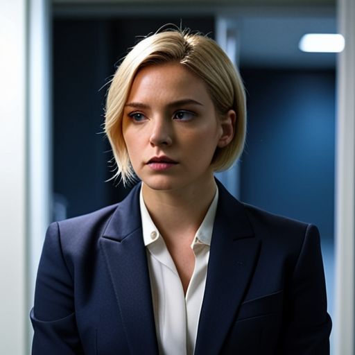
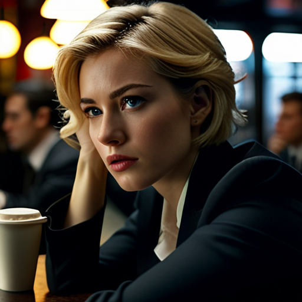

# Chapter 12: Behind the Noble Mission  

 Secondary Characters

  
**Dr. Aris Volkov (Caspian Combine)**    
 
A brilliant, once-idealistic geneticist and cloning expert from the Caspian Combine. Initially, he founded a secret medical institute with noble intentions: to use his genius to grow organs and save lives. However, his project was co-opted by corrupt and powerful elements within the Combine, who forced him—under threat to his family—to perform monstrous acts, including illegal organ harvesting and creating mindless clone "avatars" for political control. Wracked with guilt and blackmailed into complicity, he is a broken man, a tragic figure who represents the perversion of science by power. His confession to Ruby Vance becomes the catalyst that unites her and Sean against the conspiracy.

---

## A Gilded Cage

The Ministry's briefing room was a sterile chamber of polished chrome and holographic displays, buried deep within the Federation's bureaucratic heart. Ruby Vance sat across from Undersecretary Thorne, her tailored suit feeling less like armor and more like a costume. Thorne, the embodiment of Federation realpolitik—a cold, silver-haired manipulator who saw galaxies as chessboards—leaned forward, his voice as smooth as oiled steel.

"Envoy Vance," he began, activating a shimmering holo-projection of Cygnus's glittering resorts. "Your work in the post-Corvus Erden situation was... adequate. You stabilized the mess without it escalating into a full-blown war. A new opportunity has arisen."

Ruby kept her expression a perfect, neutral mask, though a familiar weariness tugged at her. Another of Thorne's "opportunities" almost certainly meant another moral compromise. "I'm listening, sir."

Thorne gestured to the hologram, which zoomed in on a proposed site—a lush island enclave in the neutral waters of Cygnus. "The Republic of Cygnus has graciously agreed to host a joint medical research center. Officially, its purpose is humanitarian advancement—advanced therapies, genetic research for war-torn populations. 'A new dawn for galactic well-being,' as the press release will say."

For the first time in months, Ruby felt a flicker of genuine interest. This sounded like a project she could believe in, a rare break from the endless warmongering. "And my role, sir?"

"You will oversee the initial setup. Liaise with the Cygnus authorities and recruit the necessary talent—top-tier scientists and experts from... available resources." He made a dismissive gesture. "As you know, we captured a Combine medical team in the Erden conflict. Their lead doctor is a specialist in advanced cloning techniques. You will meet with him at the Port Elara detention facility. Gauge his willingness to cooperate and identify other specialists he might recommend. Frame it as a chance for redemption. A contribution to peace."

Ruby's brow furrowed slightly. "Captured personnel, sir? This isn't an interrogation, is it? My clearance for such matters—"

Thorne cut her off with an impatient wave. "This is a Level 3 briefing, Envoy. A simple recruitment visit. It's entirely voluntary. You might mention that his family would be proud of his contributions to such a noble cause. A little motivation." He smiled. "Cygnus's neutrality ensures discretion. I expect your preliminary report in one week."

The hologram flickered off, plunging the room back into its cold, ambient light. Ruby sensed the undertow, the familiar calculating gleam in Thorne's eyes that always hid a deeper agenda. "Sir, is there more to this research center? Cloning technology... that's highly sensitive."

Thorne's smile was a bloodless thing that didn't touch his eyes. "It's all for the greater good, Envoy. Dismissed."

As Ruby walked towards the shuttle bay, a gnawing doubt settled in her stomach. A humanitarian project built on the expertise of a captured enemy doctor? An emphasis on "cloning"? It felt less like a noble mission and more like another one of the Federation's gilded cages. She boarded the transport to Port Elara, the weight on her conscience heavier than ever.

---

## The Confession

The interrogation room was a pressure chamber—white plasteel walls that seemed to close in, the air sterile and heavy. Ruby sat across from the doctor, her envoy's poise a thin mask over the deep unease Thorne's briefing had left her with. The man, Dr. Aris Volkov, was a portrait of a broken soul. Mid-fifties, with a disheveled beard and haunted eyes, he slumped in the magnetic restraints of his chair, the weight of weeks in isolation having carved deep lines into his face.

Ruby leaned forward, her voice a carefully calibrated instrument of empathy. "Dr. Volkov, I am Envoy Ruby Vance. Your humanitarian work in Erden was truly noble. The Federation is establishing a new medical research center on Cygnus. Neutral ground, dedicated to a new era of healing: advanced therapies, genetic breakthroughs for war-torn worlds. We would value your expertise."

Volkov's haunted eyes flickered with suspicion. "Wellbeing? After you've kept me locked in here like a lab rat? What's the real angle, Envoy?"

"There is no angle," Ruby assured him, the lie feeling thinner by the second. "This is a voluntary opportunity. A chance to contribute. Think of the impact. Your family would be so proud."

The word "family" struck him like a physical blow. His composure shattered. A low, guttural sob escaped him as his shoulders began to shake, and he buried his face in his chained hands. "Proud?" he choked out. "My family... oh, God... you think they're proud?"

Ruby's breath caught. This was no longer a recruitment. This was a confession. "Dr. Volkov... tell me."

He looked up, tears streaming down his face, his voice trembling with years of anguish. "It wasn't supposed to be like this. Fifteen years ago, I was a young researcher dreaming of miracles. Organ shortages were killing thousands. Then the Combine's Ministry of Health made me an offer: unlimited resources to build my own institute. 'For the good of the people,' they said. Accelerated cloning, vat-grown organs... no more waiting lists. I saw a Nobel Prize. I saw lives saved."

"That sounds admirable," Ruby said gently, her confusion deepening. "What went wrong?"

Volkov's voice cracked, his fists clenching against the restraints. "The 'special clients' started coming. Powerful, wealthy elites who didn't want to wait. They wanted full organs from 'donors' who weren't willing. People were trafficked in, harvested like cattle. And the cloning... God, the cloning." He shuddered. "They forced me to grow full human avatars, mindless puppets for the regime, harvested for parts or used for... other things. I tried to stop it. I went to my superiors. They laughed. And then they showed me a live feed of my wife and two daughters. 'Continue your important work, Doctor,' they said, 'or they pay the price.'"

His eyes were distant, lost in the horror of the memory. "They forced me on this 'voluntary' mission to Erden. It wasn't about medicine. It was a hunt. My job was to collect DNA from high-ranking Erden officials for cloning. To create controllable puppets they could install in power."

"And the Federation?" Ruby pressed. "How did they know to target you?"

Volkov gave a bitter, broken laugh. "When I was first captured, a high official from your Ministry of State interrogated me personally. I recognized him. He was one of my 'clients'—an anonymous one, through Cygnus. He spoke of establishing a medical research center... for the 'well-being of mankind'." The doctor spat the words like poison. "Do I look like a man foolish enough to believe that? The Federation doesn't want to end my work; they want to duplicate it for themselves."

He paused, a flicker of hesitation in his eyes, as if weighing the cost of his next words. "He told me they had a mole inside the Combine. Someone who could help me... replicate my institute here. This mole... he has an eight-year-old daughter who needs a heart-lung transplant. My institute denied her as 'non-priority.' So he turned traitor. In return for intelligence, he hopes I can save his daughter in your new facility." Volkov looked up, his eyes locking with Ruby's. "The official also told me to forget about any rescue. He said the mole would feed them the intel for any attempt the Combine made."

Ruby's stomach twisted. "Your family..." she began, her own voice trembling, "...what did they tell you about them?"

Volkov nodded, his shoulders shaking with renewed sobs. "They gave me a message, said it was intercepted from the Combine. 'A tragic raid... your failure to complete the mission cost them everything.' They wanted to break me, to force my cooperation." He looked at her, his desperation a raw, open wound. "But I can't believe it... I won't. Please," he begged, "Help me. Save my family. I can see it in your eyes... you are not like the others. They sent an innocent envoy, thinking you could persuade me without knowing the evil behind it all. But you... you could be my savior."

A sharp knock on the door. The guard's voice: "Time's up."

Ruby stood, her mind reeling, the polished chrome of the room seeming to spin around her. The "suicide mission," the captured team, the cloning—it was all one monstrous, interlocking machine.

"I will do what I can," she promised, the words feeling utterly inadequate.

As she walked out into the sterile white corridor, Volkov's final, desperate plea echoed behind her: "Promise me... end it. Protect my family. For mankind's sake, stop it!"

---

## Solid Ground

Ruby stepped out of the detention wing's secure exit, the sterile air giving way to the humid breeze of Port Elara. Her mind was a maelstrom—the doctor's confession a whirlwind of cloning horrors, veiled threats, and damning Federation complicity. Thorne's "humanitarian" center was a monstrous lie. She needed clarity, a fixed point in a spinning galaxy, but who was left to trust?

She walked towards the main gates, heading for the shuttle stop in the low-monitored buffer zone where civilian and contractor traffic mingled. Her eyes scanned the crowd of maintenance workers and off-duty staff, their colorful access badges glinting in the afternoon sun. Then she saw him.

It was just a glimpse—the familiar lean build, the way he stood with a watchful stillness, a worn cap pulled low over his eyes. But she knew. It was Sean. Here. The sight hit her like a physical impact, a wave of shock and profound relief that momentarily took her breath away. After their first tense meeting in the ruins, after the dead-drops and the dark web chats, seeing him here, in the flesh, stirred an unexpected warmth that defied all logic.

Her heart hammered against her ribs. She activated a map on her datapad, her hands not quite steady, and approached him as if he were a stranger.

"Excuse me," she said, her voice a perfect imitation of a lost official. "I'm a bit turned around after my meeting. Do you know the way to the nearest café?"

Sean—"Samir"—looked up. His eyes, the same intense eyes she remembered from the ruins of Aethelgard, locked onto hers. In that instant, a silent current passed between them. No words were needed. He saw her, not as a Federation envoy, but as the woman who had let him live. She saw him, not as a refugee technician, but as the ghost who had saved her from the Dead Man's Corridor.

His guarded expression softened, a hint of a smile touching his lips. "The Blue Nebula," he said, his voice low. "Two blocks west. It's a good spot for... rumors."

Ruby's pulse quickened. The hook. "Rumors?" she played along, her voice a quiet challenge. "Interesting. I've been hearing a few myself. About what really happened to those neutron bombs after Corvus fell."

"I've heard some whispers," he confirmed, the smile now reaching his eyes. "Follow me. I'll show you the way."

They walked in silence at first, two enemies in plain sight, their proximity a strange, electric current in the bustling crowd. He led her to the Blue Nebula, a dingy café filled with the loud chatter of off-duty contractors. The noise was a perfect shield. They found a secluded booth in the back, and Sean discreetly placed a small jammer on the table—a black-market gadget that would scramble any nearby audio surveillance.

The moment they sat, the pretenses fell away.

"Sean," Ruby breathed, her voice trembling slightly with an emotion she couldn't name. "It's really you. After all this time... After everything." She looked at him, the solid, tangible reality of him. "Seeing you here... it feels like finding solid ground in quicksand."

His gaze held hers, a rare vulnerability cracking his stoic facade. "Ruby," he said, the name a quiet confirmation. "I'm glad you're here. You've been the ghost in my machine for a long time." His expression hardened slightly. "What are they having you do at a place like this?"

Leaning in, the words spilling out in a hushed, urgent torrent, Ruby told him everything. The "humanitarian" project, Thorne's vague orders, and the doctor's horrific confession—the illegal organ harvesting, the Combine's cloning program to create controllable avatars, and the threats against his family.

Sean listened, his expression growing darker with each word. The puzzle pieces he had been holding finally clicked into place. "Avatars," he murmured. "So that's why they were so desperate to get him back. It was never just about the medical team. They need *the doctor* to run the program."

Ruby nodded, her voice barely a whisper. "And the mole... a high-ranking Combine officer. His eight-year-old daughter needs a heart-lung transplant. The institute deemed her 'non-priority,' so he turned traitor..."

Sean's eyes widened, Ruby's words hitting him with the force of a physical blow. The final piece of the puzzle, a half-forgotten rumor from the barracks, slammed into place. "Volkov," he breathed, the name tasting like ash. "Colonel Volkov. The deputy ops officer for our mission. I heard a rumor his daughter was sick... an eight-year-old."

He looked at Ruby, the full, ugly truth of the trap unfolding in his mind. "He's the mole. That's why he kept trying to halt the missions. He knew they were traps because he was the one setting them."

Sean's voice dropped to a low, grim whisper of dawning comprehension. "His own High Command wanted us erased, but he couldn't just send his men to a slaughter. So he made a deal with his Federation handlers. He gave them the mission details, but in exchange, the team was to be *captured*, not killed. It was the only way he could reconcile his conscience."

He leaned back, the pieces fitting together with sickening precision. "And his price for betraying his country? A chance to save his daughter. The Federation already had the doctor, and Volkov sabotaged our rescue mission to make sure he *stayed* in their hands. He traded everything... for her."

The air in the booth grew thick with their shared understanding. This was bigger than two nations, bigger than a war. It was a spreading cancer of corruption and horror that implicated both their governments. The bond that had started with a moment of mercy in a ruined city had led them here, to the heart of the darkness.

"The Federation is trying to duplicate this evil here," Ruby said, her voice now cold with resolve. "We have to end it. Both sides."

Sean looked at her, seeing not an enemy, but the only ally he had in the universe. His hand moved across the table, his fingers briefly brushing against hers—a spark of connection in the chaos.

"Together," he said. It wasn't a question. It was a vow.

---

#### Scene from this Chapter:  

[Sample Video](https://youtube.com/shorts/ObgiVNLAQko)

***Scene: The Doctor's Plea  
Please," he begged, "Help me. Save my family. I can see it in your eyes... you are not like the others. You... you could be my savior."
Ruby stood, her mind reeling, the polished chrome of the room seeming to spin around her. The "suicide mission," the captured team, the cloning—it was all one monstrous, interlocking machine.
"I will do what I can," she promised, the words feeling utterly inadequate.***  

[Sample Video](https://youtube.com/shorts/lywX3k2S7C0)

***Scene: A United Front  
"The Federation is trying to duplicate this evil here," Ruby said, her voice now cold with resolve. "We have to end it. Both sides."
Sean looked at her, seeing not an enemy, but the only ally he had in the universe. His hand moved across the table, his fingers briefly brushing against hers—a spark of connection in the chaos.
"Together," he said. It wasn't a question. It was a vow.***

---

[Previous Chapter](./ch11.md)|[Next Chapter](./ch13.md)

