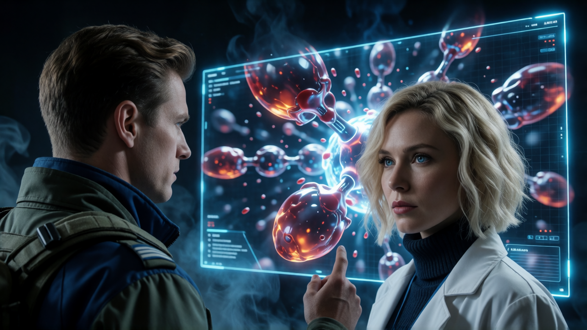

# Chapter 27:The Dead Signal   

Hope was supposed to be the cure, but on the frozen frontier of Haven-4,
it was becoming a death trap. As the last of the sick refugees recovered
in the shadow of the open-air camps, a new terror materialized in the
center of the settlement---a salvaged anti-matter reactor, dropped in
under the guise of a humanitarian upgrade. With a delegation of senators
en route and a corrupt governor holding the detonator, Major Sean Walker
and Dr. Elena Vance find themselves trapped in a deadly game of
checkmate. Exposed to a weaponized corporate conspiracy that spreads not
through blood, but through an invisible signal, Sean must dismantle a
bomb, outsmart a murderer, and risk everything before an entire colony
is erased in a flash of silent white light.

---  
<details>
<summary> Secondary Characters</summary>   

**Colonel Harker Voss (Caspian Combine)**

 

Colonel Harker Voss is a cynical, morally bankrupt career officer whose
bitter ambition is matched only by his deep-seated paranoia. Scapegoated
by former peers and banished to the frontier after barely surviving a
military court-martial, Voss views his posting at Haven-4 not as a duty,
but as a humiliating exile to a \"ghost-ridden shithole.\" Consumed by
resentment, alcohol, and greed, he readily aligns himself with the
shadow interests of Vanguard Therapeutics, taking bribes and serving as
their ruthless enforcer. To Voss, lives---whether soldiers, refugees, or
whistleblowers---are completely disposable collateral if executing them
guarantees a erased paper trail, a multi-million dark-credit payout, and
a ticket back to the gilded halls of the Capital.

</details>

<details>   
<summary>🛠️ TECH FILE: TERRESTRIAL VS. ORBITAL ANTI-MATTER REACTORS  </summary> 

```
[CLASSIFIED INFRASTRUCTURE BRIEFING - COMBINE MILITARY ENGINEERING]
SUBJECT: Class-IV Salvaged Anti-Matter Micro-Core (AM-MC4)
DEPLOYMENT DESIGNATION: Haven-4 Municipal Upgrade

```

#### **Core Operation Mechanism**

An Anti-Matter Micro-Core generates clean, virtually unlimited energy via controlled **positron-proton annihilation**.

1. **The Fuel:** Micro-injections of positrons are introduced into a reaction chamber containing ordinary baryonic matter.
2. **Magnetic Bottling:** Because anti-matter annihilates instantly upon touching physical matter, the plasma is suspended in vacuum by a hyper-dense **Electromagnetic Containment Bottle (EM-CB)** powered by high-frequency superconducting coils.
3. **Energy Extraction:** The resulting high-energy gamma photons and thermal energy are captured by surrounding MHD (Magnetohydrodynamic) converters to power planetary grids or capital ships.

Matter-Antimatter Annihilation Reaction. 
 
---

#### **The Orbital Failsafe (Deep Space Protocol)**

In deep-space habitats or orbital colonies, safety protocols are simple and absolute:

* **Jettison Failsafe:** Should the magnetic containment field experience a secondary thermal overload or magnetic decay, explosive bolts fire automatically, ejecting the entire reactor chassis into open space.
* **Deep Space Venting:** The core detonates harmlessly in the void, millions of kilometers away from any populated habitat station.

---

#### **The Terrestrial Trap (Planetary Hazard)**

When an orbital-class anti-matter plant is deployed on a planetary surface, its inherent safety mechanisms become a **weaponized liability**:

1. **No Void to Vent:** On Earth or a terrestrial colony, there is no empty space into which the core can be ejected.
2. **Missing Shielding:** Safe planetary operation requires burying the plant inside deep-crust bedrock lined with heavy permanent-magnet arrays—an engineering project taking months to build.
3. **The Field-Collapse Detonation:** Placed on open ground, if the magnetic containment field fails (via hardware glitch, EMP pulse, or targeted thermal strike), the anti-matter instantly contacts the reactor walls.

> **CONSEQUENCE:** A 0.05-second loss of magnetic containment triggers an uncontained mass-energy conversion, resulting in a **silent, white-hot thermal shockwave**. The resulting blast completely vaporizes everything within a 3-kilometer radius, leaving no radiation, no wreckage, and no physical evidence of foul play—making it the ultimate "accidental" industrial cover-up tool.


</details>

---   
## The Swarm in the Blood

Sean didn\'t just return to the ward; he invaded it, his pace frantic.
He caught Elena's eye and gestured sharply toward her lab.

The heavy isolation door of the lab hissed shut, its pneumatic seals
locking with a dull, authoritative *thud*. Once the door hissed shut
behind them, the silence felt heavy.

Sean didn\'t waste a second. He walked straight to the main terminal,
overriding the door's external access panel to display a static
*Interrogation in Progress* warning across the corridor display.

Elena stood by the central bio-bench, her analytical gaze locked on him.
She didn\'t look afraid; her posture was taut, like a coil pulled to its
breaking point. \"What happened out there, Major?\"

\"Elena, listen to me,\" Sean whispered, the urgency vibrating in his
voice. \"The political landscape just shifted. Colonel Rostova is out.
Governor\'s office has installed Colonel Voss.\"

The name hit like a physical blow. Elena's expression tightened.

\"Voss is purging,\" Sean continued. \" He wants you in chains---charges
of espionage and medical malpractice.\"

Elena's eyes widened slightly, a single beat of absolute silence falling
over the room. \"And you\'re here to enforce it?\"

\"I'm here to save your life,\" Sean replied, stepping closer. \"I
claimed jurisdiction to take you into custody personally for secure
interrogation. It\'s the only cover that keeps Voss\'s tactical squads
from dragging you to a holding cell. Dawn tomorrow, he's forcing us to
resettle the returned refugees to an open-air camp outside the main
perimeter.\"

\"He\'s driving sick, traumatized people out into the cold?\" Elena's
hands clenched into fists against her lab coat. \"They won\'t survive
forty-eight hours without intensive care.\"

\"Which is why you\'re coming with us,\" Sean said. \"You'll wear a
tactical medic's visor, mask, and heavy fatigues. To Voss\'s guards,
you\'ll just be another anonymous nurse on my detail. Give me a list of
the equipment you need and the medics you trust. I\'ll smuggle them in.
I'll make sure it gets onto the transport trucks.\"

Elena stared at him, the initial shock dissolving into a fierce, burning
determination. She reached out, gripping Sean's forearm with iron
intensity. \"It's going to be a long list, Walker. I'm not leaving my
patients behind.\"

\"And I'm not leaving you to Voss,\" Sean said, placing his hand over
hers in a firm, solid soldier's grip. \"We keep your team safe, we
protect the refugees, and when the time comes to expose Vanguard, we hit
them with everything we\'ve got.\"

Elena gave a single, sharp nod, then turned abruptly toward the hologram
wall. \"Then you need to see this first. If Voss is trying to silence
me, it's because of what I found in their blood.\"

She grabbed a sample disc, slotted it into the high-magnification
holoscope, and swiped her hand across the interface. Instantly, the wall
illuminated, rendering three-dimensional, glowing models of human
T-cells and B-cells floating in dark fluid.

\"These were isolated from the symptomatic refugees,\" Elena explained,
pointing to the structural renderings. \"When I tried to sequence their
genetic code, the RNA sequencer crashed, throwing an *\'Unreadable
Template\'* error. I thought it was a sensor malfunction, so I ran a
manual mass-spectrometry scan.\"

She zoomed in on a cell\'s outer membrane. \"They wear human surface
proteins like a uniform, Sean. But inside? There is no nucleic acid
core. No biological engine. No cellular DNA. They aren\'t infected human
cells---they\'re synthetic micro-chassis mimicking them.\"

Sean leaned in, his eyes narrowing as he studied the intricate,
artificial geometry beneath the biological shell. \"Synthetic\...\"

\"It gets worse,\" Elena continued, swiping to a second display showing
a clear bio-hazard container at the base of a centrifuge. \"After
blood-filtration, I expected this strained-out cellular mass to decay
and liquefy into normal biological slush over forty-eight hours.
Instead, the sludge at the bottom refuses to decompose. It's dense,
structural, and when I calibrated the room\'s localized electromagnetic
sensors\...\" She tapped the console. \"\...it exhibited a faint, active
magnetic reaction.\"

Sean froze. Slowly, his hand reached down to the sleek, metallic
tactical band strapped to his left wrist.

\"Julian,\" Sean whispered.

\"What?\"

\"When Julian entered the ward during his first visit, I snapped this
probe onto his wrist---told him it was for safety protocol,\" Sean said,
unhooking the sleek device and linking its interface directly to Elena's
holoscope. \"It logs raw electromagnetic signatures across all
spectrums. During his first visit, the probe caught a faint series of
magnetic pulses right after his comm-pad synced. I assumed it was just
local equipment interference.\"

Sean brought up a visual waveform on the hologram wall, its harsh white
peaks pulsing in a steady, rhythmic cadence.

\"On his second visit today,\" Sean said, \"the signal spiked hard.
Watch this.\"

Sean activated the wrist-probe's low-power active frequency emitter,
directing a localized replay of Julian\'s recorded magnetic pulse
straight at the sample disc on the holoscope.

What happened next made the hair on Sean's neck stand up.

On the hologram wall, the floating T-cells stopped their passive,
drift-like biological motion. As the magnetic pulse washed over them,
the cells snapped into formation---moving with unnaturally rigid,
hyper-coordinated swarm mechanics. They locked together like microscopic
iron filings aligning to a magnet, forming tight, geometric arrays.

Peering into the holoscope, Sean glanced up. "Do you have another
sample?"

"I do. This one is from the patient before the infection took hold."
Elena handed him the disc.

Sean slid the two discs close together. He froze; without any magnetic
pulse from the emitter to trigger them, the cells in the second sample
were mirroring the first---shifting with that same rigid,
hyper-coordinated swarm intelligence.

Elena gasped, taking a step back from the glass. \"That's not biological
chemotaxis\... that's flocking behavior. They\'re communicating.\"

\"They aren\'t just communicating,\" Sean said, his voice dropping into
a dangerous, icy register. \"They\'re talking to each other via
near-field magnetic induction. NFC micro-transceivers.\"

\"My God,\" Elena breathed, her mind racing through the medical
implications. \"That's why the contagion spreads so fast in close
quarters. It's an electromagnetic cascade signal triggering the
synthetic cells in nearby hosts. Sean, Level-4 Biocontainment suits
won\'t protect against an EM broadcast. We need physical fluid-barrier
gloves lined with conductive metal mesh or Faraday shielding to block
the signal transmission while we work!\"

Sean tapped his wrist-pad, bringing up a secure, local archive file.
Vanguard Therapeutics\' corporate emblem materialized in glowing blue
lines above the bench.

\"Vanguard Therapeutics,\" Sean read aloud, scanning the company\'s
public dossier. *\"Marketed as a single-use, non-replicating diagnostic
micro-sensor. Designed to detect early-stage cancers, map internal
biomarkers, and degrade into harmless water-soluble waste within
seventy-two hours.\"* He looked up at Elena. \"They repeatedly swore to
interstellar regulatory boards that these micro-bots carry no genetic
material, zero AI autonomy, and cannot interact with host machinery.\"

\"They lied,\" Elena said, her voice shaking with quiet fury. \"Their
nanorobots aren\'t just for diagnostic sensors. Engineering nanorobots
to perfectly mimic human immune cells takes classified military tech.\"

\"And upgrading them to override neural pathways and execute host
mind-control takes even more,\" Sean added grimly, folding his arms as
his mind pieced together the horrifying mosaic. \"Your publication in
GERI was about to expose their baseline flaw. You forced them to push
out a rushed, unstable patch to cover their tracks---and that patch is
what\'s killing those patients in the ward.\"

Silence descended over the lab, heavy and suffocating. The glowing
nanorobots on the wall continued their cold, mechanical march across the
display.

Sean looked from the screen back to Elena. The reality of what they were
facing hit him with the force of a physical blow. This wasn\'t just a
rogue officer or a corrupt governor. This was a multi-system corporate
empire protecting a weaponized conspiracy.

\"If Vanguard can\'t fix these nanobots,\" Sean said softly, \"they
won\'t risk letting the truth get out. They\'ll burn Haven-4 to the
ground and make everyone here silent\... forever.\"

A cold chill ran down Sean's spine. He stepped close to Elena, grasping
her shoulders and looking directly into her eyes with uncompromising
intensity.

\"When we step outside those gates tomorrow, you don\'t leave my side,\"
Sean commanded, his voice laced with absolute resolve. \"Not for a
second. Never out of my sight.\"

---   
## Steganography and Dark Credits

The green phosphor text on the low-bandwidth display flickered in the
dark room, casting a faint, rhythmic glow across Sean's face. He sat in
a secluded corner of the transport hub, his fingers resting over the
encrypted keyboard.

On screen, the public interface was masquerading as an amateur
meteorology message board---a humble forum tracking wind vectors and
pressure fronts across the Sironan border. But beneath the weather logs,
buried three layers deep in steganographic code, a private channel
blinked to life.

**\[RUBY\]:** *They're calling it medical malpractice.*

The prompt paused, the cursor pulsing erratically for a second as if the
person typing on the other end was fighting to keep her composure.

**\[RUBY\]:** *The irony is sickening, Sean. The real murderers are
sitting in air-conditioned suites in the Capital, and they're blaming
Elena for every body in that ward. It's an outrage.*

Sean typed back, his keystrokes quiet and deliberate.

**\[SEAN\]:** *Elena's holding up. She refused the safer assignment
inside the inner line. She chose to stay in the open-air refugee camp
where the patients are.*

A short pause before Ruby's response materialized on screen.

**\[RUBY\]:** *That sounds like her. Forged in self-sacrificing steel.
I'm already pulling strings with my contacts in the Cygnus
Ministry---putting political pressure on the Combine high command to
drop the charges and grant her immunity. But red tape takes time. What
do you need on the ground right now?*

**\[SEAN\]:** *Dark currency. Off-grid, untraceable credits. Voss's
guards are corrupt, but they don\'t take promises. I need enough liquid
capital to bribe the perimeter detail and bleed medical supplies through
the wire.*

**\[RUBY\]:** *Consider it done. I'm routing a series of micro-transfers
right now. Straight out of Governor Grim's seized offshore accounts and
into your blind digital wallet. He won\'t notice it until he tries to
pay for his next glass of champagne in Cygnus.*

A notification icon flashed in the corner of Sean's terminal.
*TRANSACTION VERIFIED: 150,000 UNTRACEABLE CREDITS LOADED.*

**\[RUBY\]:** *What\'s your next move?*

Sean leaned closer to the monitor, his expression hardening.

**\[SEAN\]:** *I need to map the skeleton behind Vanguard Therapeutics.
I want to know who really owns them, who funds them, and how deep their
roots extend into the High Command. A premature strike will only trigger
a mass wipeout---we've already seen how they react when cornered.*

**\[RUBY\]:** *The rushed nanobot patch.*

**\[SEAN\]:** *Exactly. That patch was a panic response to Elena's paper
published in* GERI*. If we push too hard without knowing their reach,
they won\'t just patch the code next time---they'll delete the
witnesses. Every sick refugee. Elena. Us.*

**\[RUBY\]:** *I\'ll dig into Vanguard\'s paper trail from this end.
Beyond Victor Stark's black-market archives, I'll cross-reference Lena
Korva's old intelligence dumps. If Vanguard has a shadow board, Korva's
network would have logged it.*

**\[SEAN\]:** *Unearth everything you can. And keep an eye on the
Scourge border movements. If their fleet shifts position, I need to know
before Voss does.*

**\[RUBY\]:** *Understood.*

The lines of text began to auto-scrub, dissolving into random strings of
atmospheric pressure data. Before the channel closed completely, one
last message blinked at the bottom of the screen.

**\[RUBY\]:** *Watch your back out there, Sean. Please.*

Sean's fingers lingered on the keys for a long heartbeat, warmth cutting
through the cold isolation of the terminal room.

**\[SEAN\]:** *Always. You too, Ruby.*

With a single tap, the interface wiped itself clean, returning to a
mundane radar map of shifting clouds. Sean pulled his data-pad from the
console, stepped out into the night air, and prepared to buy his way
past Voss's guards.

---   
## The Trojan Power Core

In the mud-churned expanse of the new settlement, survival was measured
in cc's of saline and liters of smuggled clean water.

Sean kept Elena within five paces at all times. She wore a heavy
tactical medic visor, oversized fatigues, and an insulated scarf that
hid half her face, appearing to any outside observer as just another
anonymous field nurse assigned to his personal detail. They worked
fourteen-hour shifts in the central triage tent, their hands raw from
antiseptic and their boots coated in freeze-dried sludge.

It didn\'t take long for the perimeter detail to notice.

Around the oil-drum braziers at night, the guards tossed back cheap
synthetic vodka and passed around cheap theories. They watched the Major
escort his \"nurse\" back to his private command trailer at the end of
every watch. They saw the way he shielded her from the daily headcounts
and how she moved through the camp without the wrist-shackles mandated
for \"high-risk political detainees.\"

*\"The Major's got himself a quiet little setup,\"* a squad sergeant
grunted one night, watching Sean usher Elena into the command tent.
*\"He certainly has a type. Looks enough like that Cygnus diplomat to be
her sister.\"*

*\"Let him have his perk,\"* another guard muttered, thumbing through a
stack of untraceable digital credit-chips Sean had handed over earlier
to \"overlook\" a crate of unregistered medical filters. *\"As long as
his dark-credits keep clearing, he can keep a dozen mistresses for all I
care.\"*

Sean overheard the whispers through the tent canvas, but he never
corrected them. He cultivated the lie. In a corrupt occupation force, a
moral officer was unpredictable and dangerous. A corrupt officer who
took bribes and kept a secret lover was familiar, predictable, and
easily bought. More importantly, the rumor created a dark psychological
fence: the guards viewed Elena as the Major's personal property, and on
the frontier, nobody was stupid enough to touch a Major's collateral.

For six grueling months, the makeshift clinic ran on razor-thin margins.
Using the black-market credits Ruby funneled through the Weather Forum,
Sean bought off the perimeter guards while Elena worked logistical
miracles inside the tents. Every patient who walked out of the
filtration unit with clean blood readings was a victory bought with
blood and nerve. For Elena, every recovered patient was a victory that
gave her the strength to keep going.

Then came the day the last containment bed was cleared.

With the epidemic controlled and the camp stabilized, Ruby moved her
pieces from the Capital. She leaked sanitized medical data and
eyewitness logs to the independent Cygnus news networks, sparking an
international media storm. The Combine's political opposition seized on
the story, and within forty-eight hours, a bipartisan delegation of
Combine senators formally requested an emergency inspection tour of
Haven-4.

In the camp, hope spread faster than any virus ever could.

The refugees draped faded yellow ribbons over the perimeter fences.
Banners stitched from recycled ration sacks fluttered against the gray
sky, painted with crude, bold lettering: **WE ARE CLEAN. WE WANT TO GO
HOME.**

The news of the senatorial visit, however, forced Vanguard Therapeutics
to accelerate their timetable.

Three days before the delegation was scheduled to land, the heavy
transport haulers arrived under escort by Voss's elite security forces.
They didn\'t bring food or medical supplies. Instead, they hauled a
colossal, spherical containment chassis into the exact geometric center
of the settlement. It came from a retired space-colony.

The Capital issued an official press release declaring it a
\"humanitarian infrastructure upgrade\"---a salvaged, military-grade
anti-matter power core intended to provide abundant energy for the
settlement before the senators arrived.

Sean stood on the raised catwalk of the perimeter wall, his hands
gripping the freezing steel railing as he watched the massive crane
lower the reactor into its temporary housing.

A cold, sickening dread settled in his stomach.

He knew the engineering specs of space-colony anti-matter plants inside
and out. On an orbital station, containment physics were
straightforward: if the primary magnetic bottle failed, the automated
failsafe simply jettisoned the entire reactor module into the void of
space, letting it detonate safely millions of kilometers away.

On a planetary surface, there was no void to vent into.

To safely contain a terrestrial anti-matter core of that scale required
deep-crust subterranean shielding or massive, redundant permanent-magnet
arrays---components that took years to engineer and were impossible to
source on the black market. Placed on open ground, a simple
\"containment fluctuation\" or a single staged magnetic spike would
trigger a catastrophic containment collapse.

It wouldn\'t look like an execution. It would look like a tragic,
regrettable industrial accident---a rogue power plant wiping out the
camp, the refugees, the evidence, and the whistleblowers in a blinding
flash of silent white light.

Beside him, Elena stepped up to the railing, her eyes fixed on the
throbbing blue glow of the reactor's baseline field.

\"Is that what I think it is?\" she asked softly, her voice barely
carrying over the thrum of the cooling fans.

\"It's not a power plant, Elena,\" Sean said, his tone flat, devoid of
emotion, and deadly cold. \"It's a bomb. And Vanguard just put their
finger on the detonator.\"

---  
## The Dead Hand\'s Trigger
 
The double doors to the Governor's office swung shut, shutting out the muted hum of the command bunker.

Sean was instantly hit by a wall of stale, unventilated heat and the
cloying, sour stench of spilled, cheap liquor. The room was a graveyard
of broken routine---empty amber bottles littered the floor like spent
shell casings, and dark, sticky rings stained the massive mahogany desk.

Colonel Voss didn\'t look up when Sean entered. He sat slumped in a
high-backed leather chair, staring blankly out the reinforced bay window
at the sprawling, mud-slick refugee settlement in the valley below. His
uniform tunic was unbuttoned at the throat, his graying hair matted with
sweat.

When he finally turned, his eyes were bloodshot, glassy, and filled with
a dangerous, unstable heat.

\"Do you know why you're here, Walker?\" Voss asked, his voice raspy,
trailing off into a wet, rasping cough.

\"I assume the Colonel has an operational assignment for me,\" Sean
replied, standing at crisp attention, his voice carefully devoid of
tone.

Voss let out a short, jagged laugh that sounded more like a bark.
\"Assignment. That's a polite word for it.\" He reached for a crystal
decanter with a hand that shook visibly, pouring amber liquid into a
tumbler until it splashed over his knuckles.

\"I had a partner once,\" Voss muttered, staring into his glass. \"A
brother-in-arms. He sold me out to the High Command---accused me of
taking kickbacks from Vanguard Therapeutics to look the other way during
their field trials. The joke of it? He was the one who pocketed every
credit. Including my cut.\"

He slammed the glass down on the wood with enough force to crack the
crystal, dark liquor pooling across a stack of official casualty
reports.

\"I survived the court-martial by a miracle,\" Voss spat, his jaw
trembling with years of accumulated bile. \"And as my reward, the
Capital banished me to this ghost-ridden shithole to sweep up their
bio-waste.\"

Sean remained standing, a silent, unreadable statue. \"Is there
something I can do to assist you with the transition, sir?\"

Voss looked up, his bloodshot eyes narrowing as the drunkenness receded
behind a sudden, icy focus. \"Let\'s just finish the job, Major. We get
it done, and we both go back to the Capital to drink wine that doesn't
taste like vinegar.\"

\"Which job, sir?\"

Voss didn\'t answer with words. He leaned back and pointed a
tremor-riddled finger toward the window---toward the pulsing blue glow
of the anti-matter reactor sitting in the center of the refugee camp.

Then, he reached into his desk drawer and slid a heavy, matte-black
module across the mahogany surface.

To an untrained recruit, it resembled a standard telemetry sensor used
for logging core temperature fluctuations. But Sean's tactical eyes
recognized the internal circuitry immediately: a localized high-yield
electromagnetic pulse trigger. A field-collapse device designed to
override magnetic containment.

\"Safety first,\" Voss sneered, a bitter grin stretching across his
cracked lips. \"We can\'t have that reactor behaving unpredictably when
the Senate delegation arrives. I want you to personally install this
\'monitoring sensor\' directly onto the primary containment housing.\"

Sean looked from the matte-black trigger to the man sitting behind the
desk. The subtext was crystal clear. Voss wasn\'t asking him to monitor
the plant; he was ordering him to prime the charge.

\"You want me to set the fuse,\" Sean said softly.

\"I want you to ensure that by the time those high-and-mighty senators
touch down, there is nothing left of this settlement but a
three-kilometer crater,\" Voss replied flatly.

He pulled a folded piece of parchment from his tunic and tossed it onto
the desk beside the device. On it was a twenty-four-digit access key to
an untraceable dark-currency account---a balance with enough zeroes to
buy a private estate on Cygnus.

\"Is that enough to secure your cooperation, Major? Because if you play
your part smoothly, the number doubles.\" Voss leaned forward, the foul
smell of stale vodka and decay wafting over the desk. \"When the inquiry
opens, you simply submit a report stating you observed \'suspicious
elements\'---perhaps Scourge insurgents---tampering with the plant\'s
cooling lines. A tragic accident. A national tragedy. In exchange, I'll
see to it your promotion to Lieutenant Colonel clears the Command Board
before the smoke clears. Attractive enough for you?\"

Sean stared at the glowing numbers on the paper, then back at the
matte-black trigger. His mind raced through the tactical geometry. If he
refused, Voss would simply execute him and hand the trigger to a
loyalist squad. Accepting gave him the trigger---and control over the
clock.

\"It\'s very attractive, sir,\" Sean said, his voice dropping into a
calm, unshakeable drone. \"I'll install it. But I will route the arming
sequence through my own encrypted comm-pad to synchronize the
installation. In case someone\... misfires the signal prematurely.\"

Voss went still, his heavy, bloodshot eyes searching Sean's face for any
sign of hesitation or deceit. For three long seconds, the only sound in
the room was the low, electric thrum of the rain beating against the bay
window.

Then, a slow, yellow-toothed smile spread across the Colonel's face. He
extended a clammy, shaking hand across the desk.

\"Deal. You\'re a cautious man, *Lieutenant Colonel* Walker. I like
cautious men. They stay alive.\"

Sean took the hand, gripping it firmly despite the slick sweat on
Voss\'s palm, then picked up the black module and the paper. \"I\'ll
begin the installation immediately.\"

Sean turned and walked out. As the heavy double doors clicked shut
behind him, plunging him back into the cold, sterile light of the
corridor, the silence felt deafening.

He looked down at the matte-black device in his palm. The clock had
officially started. He had less than forty-eight hours to disarm a
nuclear-scale failsafe, save a thousand lives, and expose a corporate
empire---before a delegation of senators arrived for a visit none of
them were meant to survive.

---  
## Scene 5: Checkmate in the Tower

The Haven-4 central control room reeked of cheap synthetic brandy and
cold sweat.

High above the settlement, the panoramic reinforced glass windows
overlooked the valley, where the anti-matter reactor's primary core
pulsed with an eerie, rhythmic azure glow. Down in the refugee camp,
yellow ribbons fluttered against the wind as the senatorial shuttle's
flight path flashed green on the main tracking display.

Colonel Voss paced behind the primary command console, his fingers
twitching over his belt. When Sean stepped through the sliding doors,
Voss rounded on him, his eyes bloodshot and unhinged.

\"You're late!\" Voss hissed under his breath, leaning in so close Sean
could smell the stale alcohol on his breath. \"The Senate delegation
lands in less than forty minutes! You were supposed to be here two hours
ago!\"

\"I was running diagnostic checks on the trigger module,\" Sean replied,
his voice a steady, unbothered drone. \"A plant like that requires
precision.\"

\"Is it primed?\" Voss demanded, his voice cracking with anxiety. \"Are
we ready?\"

\"Ready,\" Sean said.

Voss gestured frantically toward the sleek comm-pad on the tactical
bench. \"Do it. Press it now.\"

Sean pulled his military tablet, brought up the remote override
interface, and tapped the glowing activation node.

Nothing happened.

The blue pulse of the anti-matter core down in the settlement remained
smooth, steady, and unbroken.

Sean tapped the interface again, harder this time. The display flashed a
flat amber status prompt: *SIGNAL UNRESOLVED -- TRANSMISSION TIMED OUT.*

\"Glitch in the remote link,\" Sean said, looking up with practiced
frustration. \"The heavy magnetic interference from the reactor must be
jamming the signal frequency. I'll need to head down to the floor to
check the receiver directly.\"

\"Damn it! No!\" Voss snapped, grabbing Sean's shoulder with a clammy,
white-knuckled grip. \"There's no time! Look at the board---the Senate
shuttle is entering outer orbital descent!\"

Voss began pacing in tight, frantic circles, dragging a shaking hand
through his thinning hair. His eyes darted wildly across the primary
console's weapon array until they locked onto the planetary defense grid
interface. A desperate, malicious grin spread across his face. He leaned
into Sean, his voice dropping into a conspiratorial whisper.

\"The auxiliary target laser,\" Voss muttered, tapping the glass panel
over the orbital defense subsystem. \"Fire a concentrated thermal burst
directly into the primary cooling jacket of the core. It'll trigger the
exact same magnetic collapse. Pure, instantaneous thermal shock.\"

Sean kept his face entirely expressionless. \"A manual strike leaves an
energy trace on the system log, sir.\"

\"Then we write the log right now!\" Voss hissed, shoving a piece of
scrawled paper into Sean\'s hands. \"Here's your script. Read it aloud
for the room\'s open flight recorder. Act it out!\"

Sean unfolded the note, glancing at the line Voss had scribbled, buying
every second he could. \"Colonel Voss\... my sensors are picking up
abnormal magnetic flux signatures near the reactor core.\"

Voss immediately puffed out his chest, raising his voice so the floor
technicians in the room could hear. \"Major Walker! Identify the source
of that anomaly immediately!\"

Sean tapped his tablet at a deliberately agonizing, slow pace, letting
seconds tick away. \"Reading\... source appears to be an unregistered
civilian transport truck parked near the containment barrier.\"

\"Is it one of your security details?\" Voss barked, playing his role
for the audio log.

Sean tapped his screen again, letting another long, agonizing silence
stretch through the room. \"Negative, sir. No friendly units are
scheduled in that grid.\"

Voss feigned a look of outrage, stepping toward the main tactical
console. \"To ensure the absolute safety of the infrastructure before
the senators land, Major, lock target vectors on that truck and fire a
low-power neutralization laser to eliminate the threat!\"

Sean stepped up to the targeting console, his fingers hovering over the
fire control array---pretending to lock coordinates while watching the
countdown clock on the wall tick down to zero.

Before his fingers touched the board, the comms officer at the rear desk
suddenly sat bolt upright.

\"Sir!\" the lieutenant shouted, his voice cutting through the room.
\"Ground sensors report heavy armored vehicles moving onto the
perimeter! Colonel Rostova's heavy brigade has just deployed in full battle
formation---they're surrounding the entire settlement! They are
demanding an open command link!\"

Voss went rigid. \"What? Get him on the line!\"

The central holo-projector flickered to life, and Colonel \"Ox\"
Rostova's battle-scarred face materialized above the console. Behind
him, the background hum of heavy tank engines vibrated through the audio
feed.

*\"This is Colonel Rostova,\"* Ox announced, his deep voice filling the
control room like thunder. *\"We have received credible, high-priority
intelligence that Scourge insurgents intend to launch a mass-scale
strike against the new settlement during the senatorial visit. My
brigade has taken up defensive positions to secure the perimeter,
protect the refugees, and safeguard the delegation.\"*

Voss's face flushed a violent, mottled red. \"This is Colonel Voss! We
are currently managing a critical energy anomaly at the central plant!
Fall back your troops to a safe distance immediately!\"

*\"My men are already on the ground, Voss,\"* Ox countered flatly.
*\"Transfer the anomaly\'s coordinates to my tactical feed. My strike
team will neutralize the threat on the deck.\"*

\"There is no time for ground protocols!\" Voss roared into the
comm-mic, sweat dripping from his chin onto his collar. \"Retreat your
forces now!\"

*\"Negative,\"* Ox's voice came back, cold as glacial iron. *\"We do not
retreat until the safety of the settlement and the Senate delegation is
guaranteed. Rostova out.\"*

Voss slammed his fist onto the console, his breath coming in ragged,
desperate gasps. He turned back to Sean, his sanity fraying at the
edges. He grabbed Sean's tactical vest, dragging him close, his voice a
frantic, manic whisper.

\"Just fire the laser into the core,\" Voss rasped, his eyes bulging.
\"Fire it now! It takes out the plant, it takes out the camp, and it
takes out Rostova's whole damn brigade in one clean stroke! We wipe the
slate, collect the credits, and we go home!\"

Sean didn\'t flinch. Slowly, deliberately, he reached down, unhooked
Voss's hands from his vest, and took a step back.

Then, Sean raised his voice, shouting so loudly his words echoed off the
steel walls:

**\"Are you ordering me to detonate the reactor, Colonel?\"**

Voss froze, stunned. He stared at Sean in utter disbelief. \"What---\"

**\"Are you ordering me to murder a thousand civilians and a Combine
brigade, Colonel Voss?\"** Sean yelled again, his voice ringing across
the silent room like a gong.

The floor technicians stopped typing. The lieutenants turned around,
their faces pale with shock.

Voss's face twisted into a snarl of sheer rage. \"Damn you! It's a
direct order to fire the laser! Do it now, you coward!\"

A suffocating, dead silence fell over the control room. Nobody moved.
Nobody breathed.

Then, the comms speaker on the main console crackled back to life.

*\"Colonel Voss,\"* Ox's voice echoed across the open channel, smooth
and heavy. *\"Our tactical comm-arrays just intercepted that exchange on
an open emergency band. Care to explain your orders to the garrison?\"*

The channel played back Voss's desperate whisper, amplified with
terrifying clarity through the overhead speakers: *\"Then just fire the
laser into the core\... It takes out the plant, it takes out the camp,
and it takes out Rostova's whole damn brigade\...\"*

Voss's blood drained completely from his face, leaving him paper-white.

Before the disgraced Colonel could reach for his sidearm, Sean pulled
his own service pistol in a single, fluid motion, racking the slide and
placing the barrel directly between Voss's eyes.

\"Colonel Voss,\" Sean said, his voice dropping into a deadly, icy calm.
\"You are under arrest for high treason, attempted mass murder, and
mutiny against the Combine Command.\"

Sean turned his sharp gaze across the frozen control room. \"Anyone who
interferes with this arrest will face a military tribunal for
complicity. Sergeant---handcuff him now.\"

The desk sergeant stepped forward on trembling legs, unholstering a pair
of heavy magnetic restraints. Voss didn\'t fight back; his body seemed
to deflate as the steel cuffs snapped around his wrists.

Voss looked up at Sean, his eyes filled with a hollow, bitter hatred.
\"You have no idea what you\'ve done, Walker,\" he spat softly. \"You
think you won? Vanguard Therapeutics will crush you like a bug. You\'ll
regret this.\"

\"Take him to the holding cell,\" Sean ordered, stepping back as the
guards dragged Voss out.

Sean tapped the main comm-console, opening a direct channel to the
valley below. \"Major Walker to Colonel Rostova. The threat inside
command has been neutralized. Voss is in custody. Haven-4 is yours,
sir.\"

*\"Acknowledged, Major,\"* Ox replied over the static. *\"Open Gate
North for heavy armor entry.\"*

Sean snapped his head toward the terrified comms lieutenant.
\"Lieutenant. Open Gate North. Now.\"

An hour later, the quiet inside the Governor\'s private office was a
welcome relief.

Ox stood by the window, watching the sleek senatorial shuttle ignite its
thrusters and lift off into the gray clouds. He had personally escorted
the delegation to the pad, smoothly explaining that Colonel Voss had
been unexpectedly relieved of command due to an \"urgent internal
administrative matter.\"

Ox turned back to Sean, a rare, faint smile touching his rugged face.
\"That was tight, Sean. If my audio play hadn\'t cut through, I was
worried Voss would panic and slam that laser firing key himself.\"

\"I was counting on your timing,\" Sean said, leaning back against the
mahogany desk, letting out a long breath he felt like he'd been holding
for months. \"If you hadn\'t broadcast that recorded loop, the whole
valley would be ash right now.\"

Ox walked over, placing a heavy, calloused hand on Sean's shoulder. \"I
had to run the signal decryption through our mobile suite before I could
push the audio live. If we ran out of time, my contingency was to drive
a shield-truck right into the beam line to absorb the flash.\"

\"Thanks for the rescue, Ox,\" Sean said softly. \"Without you, none of
us walk away from this.\"

Ox gave a short, gruff laugh. \"You saved my life twice in the camps,
Walker. I saved yours once today. By my count, I still owe you one.\"

Sean smiled faintly, though his eyes quickly turned serious. \"The
immediate crisis is over, but the real fight starts now. Voss was just a
pawn. When Vanguard Therapeutics realizes their bomb didn\'t go off,
they'll use every senator in the Capital to rewrite the story.\"

\"Then we make sure our statements match,\" Ox said, his posture
straightening. \"We prepare a joint military deposition---you, me, and
Dr. Vance. I\'ve dealt with political inquiry committees before, Sean.
They\'re loud, they\'re corrupt, but they\'re cowards when faced with
cold, hard military evidence.\"

\"We aren\'t just giving depositions,\" Sean said, a dangerous glint
entering his eyes as he pulled out his encrypted terminal. \"While you
hold Haven-4, we hit them where they think they\'re safest.\"

Within ten minutes, Sean logged back into the Weather Forum,
transmitting a single, high-priority signal to Ruby in the Capital: *THE
BOMB IS DISARMED. UNLEASH EVERYTHING.*

Ruby didn\'t waste a second.

Using her network in the Cygnus ministry and her hidden access to Victor
Stark\'s encrypted archives, Ruby launched a coordinated media strike
across every major interstellar news grid.

Within hours, high-definition footage leaked globally:

The terrifying video of Julian executing a symptomatic refugee in the
ward.

The holoscope recordings showing the synthetic immune cells swarming
under Near-Field Communication pulses.

And Elena Vance's unedited, damning research paper detailing Vanguard
Therapeutics' corrupted, weaponized nanobot patch.

The scandal tore through the Capital like a wildfire.

Public outcry exploded. Emergency oversight committees were formed
within the Combine Senate, the Cygnus High Ministry, and the
Interstellar Health Organization. Vanguard Therapeutics\' stock plunged
into a freefall as federal marshals froze their assets pending a full
criminal tribunal.

Three days later, an official summons from the High Command arrived at
Haven-4.

Major Sean Walker, Colonel Ivan Rostova, and Dr. Elena Vance were
officially recalled to the Capital to give sworn testimony before the
Joint Congressional Inquiry.

As Sean stood on the shuttle ramp, looking back one last time at the
peaceful, quiet settlement of Haven-4, he knew the easy part was over.

The battle in the mud and cold was finished. Now, the war was moving
straight into the polished, gilded halls of the Capital.


---  
---  

[](https://youtu.be/IufmseqS4-0)  
[Sample Video](https://youtu.be/IufmseqS4-0)  


***Scene: That’s not biological chemotaxis... that’s flocking behavior.**  

When Dr. Elena Vance and Major Sean Walker place the synthetic cell samples under the high-power holoscope display, they expect to see a natural biological reaction. Instead, they witness an terrifying truth: thousands of microscopic nanobots, aligning into rigid, geometric swarm formations in real-time under a pulsed magnetic signal.    

They aren't just fighting an outbreak on Haven-4. They're up against an artificial, weaponized contagion designed to respond to an invisible switch.    


Elena gasped, taking a step back from the glass. \"That's not biological
chemotaxis\... that's flocking behavior. They\'re communicating.\"

\"They aren\'t just communicating,\" Sean said, his voice dropping into
a dangerous, icy register. \"They\'re talking to each other via
near-field magnetic induction. NFC micro-transceivers.\"


---  

[Previous Chapter](./ch26.md)


