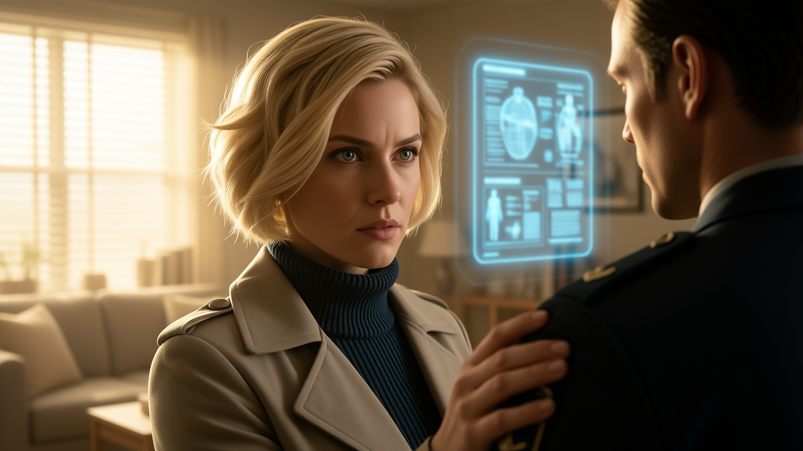

# Chapter 28: A Cage of Marble and Gold

In the polished marble halls of Capital Vanguard, silence was far more
dangerous than gunfire. The war on the frontier was over, but a far
deadlier battle had begun---one fought with redacted files, coerced
oaths, and conveniently timed obituaries. As the machinery of power
moved to erase every loose end of the Haven-4 crisis, Colonel Sean
Walker and Dr. Elena Vance were left standing on a razor's edge. They
weren\'t just searching for the truth anymore; they were racing against
a quiet executioner who never missed a target.

--- 

   

 📜 Historical Spotlight: The Presidential Commission 

> 
> 
> Throughout history, when ordinary government bodies fail, become compromised, or face an unprecedented crisis, American Presidents have bypassed standard bureaucracy by establishing extraordinary investigative bodies—often called **Presidential Commissions** or **Special Task Forces**.
> Created by Executive Order, these bodies are granted broad mandate to uncover the truth, reassure an anxious public, and hold powerful institutions accountable. Notable real-world precedents include:
> * **The Roberts Commission (1941–1942):** Appointed by President Franklin D. Roosevelt immediately following the attack on Pearl Harbor to investigate intelligence failures and military unpreparedness.
> * **The Warren Commission (1963–1964):** Created by President Lyndon B. Johnson to investigate the assassination of President John F. Kennedy amid rampant conspiracy theories and mistrust of federal agencies.
> * **The Rockefeller Commission (1975):** Formed by President Gerald Ford to investigate illegal domestic spying, secret MKUltra experimentation, and unauthorized black-budget operations conducted by the CIA.
> * **The Rogers Commission (1986):** Established by President Ronald Reagan following the *Challenger* space shuttle disaster, successfully uncovering severe organizational and engineering oversights within NASA.
> * **The Tower Commission (1986–1987):** Created by President Reagan to conduct an independent inquiry into the Iran-Contra scandal, probing covert arms deals and national security council overreach.
> * **The 9/11 Commission (2002–2004):** Formed under President George W. Bush to provide a comprehensive accounting of the September 11 attacks, intelligence sharing breakdowns, and recommendations for national defense reform.
> 
> 
> **Why Presidents Form Special Commissions:**
> 1. **Public Trust & Transparency:** When the public suspects a government cover-up, an independent panel led by respected figures serves to restore faith in the system.
> 2. **Bypassing Bureaucracy:** Standard agency channels can take years to investigate themselves. A special commission reports directly to the Chief Executive with extraordinary subpoena and investigative latitude.
> 3. **Political Shielding:** A public commission puts the burden of proof on an independent panel, allowing a President to pursue corrupt institutions without appearing to run a political vendetta.

---  

## Tied Hands and Loose Ends

The tarmac at Capital Vanguard offered no warmth, only the blinding
glare of floodlights and the hum of heavy military transports. The
moment the shuttle ramp hissed open, the divide was absolute.

A sleek diplomatic detail from the Cygnus Embassy moved in first,
surrounding Dr. Elena Vance in an impenetrable envelope of diplomatic
immunity. She looked back over her shoulder at Sean, her sharp,
analytical eyes wide with unvoiced concern, before being swept away into
a black armored sedan.

Sean and Colonel \"Ox\" Rostova had no such shield.

Two armed escorts from Military Intelligence flanked them before their
boots even hit the landing pad. Bypassing the civilian terminals, they
were driven directly to High Command Headquarters---a looming monolith
of polished obsidian and reinforced steel.

The debriefing room in Sub-Level 2 was sterile, air-conditioned to a
chill, and devoid of windows. A senior liaison officer tossed two thick
data-pads onto the table.

\"You are under active investigation for charges of military
insubordination and mutiny regarding your conduct at Haven-4,\" the
officer said without warmth. \"While you are obliged to testify before
the Joint Congressional Inquiry, High Command reminds Major Walker and
Colonel Rostova that classified operational details surrounding Colonel
Harker Voss remain protected under High-Threat Clearance Regulations.
Any unauthorized disclosure regarding Colonel Voss's detention will be
treated as high treason.\"

It wasn\'t a debriefing. It was a gag order. Speak too freely to
Congress, and the military would crush them in a court-martial before
they reached the courtroom doors.

Three days later, while Sean waited in solitary quartering under
military surveillance, the first \"loose end\" was tied. Vanguard
Therapeutics issued a brief, solemn press release: *Dr. Julian Mercer,
Chief Medical Research Officer, had passed away suddenly from acute
cardiac arrest.* Sean stared at the glowing headline on his holo-pad. A
heart attack. A convenient, untraceable end for the man whose visit had
triggered the cover-up. Vanguard's fixers were already at work,
sanitizing the paper trail.

A week later, Sean stood beneath the arched marble ceiling of Hearing
Room 402. The gallery was packed with journalists, corporate lobbyists,
and anxious citizens, their murmurs echoing off the walls. Arrayed on
the elevated bench before him were the members of the Joint
Congressional Inquiry.

At the center sat Congresswoman Audrey Miller, representing Capital
Vanguard's 7th District. Sharp, poised, and fiercely articulate, she
looked down at Sean through thin-framed glasses, her datapad glowing
with unredacted testimony.

\"Major Walker,\" Congresswoman Miller began, her voice carrying clearly
across the silent chamber. \"You were on the ground during the primary
outbreak. Can you tell this committee who issued the direct order to
cremate patient remains without performing standard autopsies following
Dr. Julian Mercer's visit?\"

Sean stood at attention at the witness podium, his uniform crisp, his
face a disciplined mask. \"I do not know, Congresswoman. I received no
such order.\"

\"Let me refresh your memory,\" Miller said, leaning forward. \"Colonel
Rostova testified before this committee yesterday that he was forcibly
relieved of his post at the Governor\'s Office prior to Dr. Mercer's
arrival. Furthermore, Colonel Harker Voss---the acting commander---is
currently held in military detention on undisclosed charges and has been
withheld from testifying today. In the command chain at Haven-4, who
possessed the legal authority to bypass protocol and order those
cremations without Colonel Voss\'s explicit signature?\"

\"Under Haven-4 operating regulations, such an order would require
executive authorization from the Governor\'s Office or the senior
military commander,\" Sean replied measuredly. \"It is plausible that
Colonel Voss initiated the order, but without access to the official
logs, I cannot confirm it.\"

Miller's gaze narrowed slightly. \"Understood.\" She swiped to a new
file on her tablet. \"Let us move to the medical response. Dr. Elena
Vance testified that her patients were actively recovering under the
treatment protocol she published through the Global Epidemic Response
Initiative. Can you confirm her assessment?\"

\"Yes, Congresswoman,\" Sean said firmly. \"I witnessed the recoveries
personally. Her protocol worked.\"

\"Good,\" Miller said, her tone sharpening like a drawn blade. \"Then
explain this to us, Major: If Dr. Vance was actively curing a deadly
contagion, why did you execute Colonel Voss's order to arrest her and
seize her medical facility?\"

The question hung in the air like an accusation. Sean felt the weight of
the cameras in the gallery, the unseen eyes of High Command watching
every twitch of his jaw.

\"With all due respect, Congresswoman,\" Sean said, his tone flat and
even, \"we are soldiers. We are trained to execute lawful orders from
our chain of command, not to debate them.\"

Miller didn\'t blink. \"And with all due respect, Major Walker, do not
hide behind your rank. You are a senior field officer, not a private
fresh out of basic training. You knew lives were at stake.\"

Sean remained silent, meeting her sharp gaze without offering an excuse.

Miller tapped her pen against the wood desk, her frustration evident.
\"During the subsequent senatorial delegation visit, Colonel Voss was
abruptly removed from command and replaced by Colonel Rostova. What
precisely transpired that led to Colonel Voss's sudden removal?\"

\"I am not authorized to disclose details regarding ongoing military
investigations, Congresswoman.\"

The gallery stirred. Miller's patience snapped. She leaned directly into
her microphone, her voice dropping into a dangerous, icy register.

\"Let me remind you, Major Walker: you are standing under oath before a
Congressional Inquiry,\" Miller said, her knuckles turning white against
her pen. \"If this committee discovers that you are withholding evidence
or shielding military leadership from public accountability, I will
personally ensure that your next posting is a cage in a federal
penitentiary.\"

Sean held his breath for a fraction of a second, the threat echoing off
the marble walls.

\"Understood, Congresswoman,\" he said quietly.

When the hearing adjourned, it left the public with more questions than
answers. Rumors of synthetic nanobots and weaponized biological signals
continued to circulate through the capital, fueling widespread panic.
Vanguard Therapeutics\' stock plummeted, but the corporate machine
remained shielded behind layers of legal bureaucracy and classified
military exemptions.

One week later, the final blow fell.

High Command released a brief, two-sentence bulletin: *Colonel Harker
Voss had died in his holding cell due to acute ethanol toxicity. The
internal military investigation into his conduct was officially closed
due to the death of the subject.*

Sean sat in his darkened quarters, reading the notice over and over.
Voss hadn\'t died of alcohol poisoning---he had been silenced. With Voss
dead and Mercer buried, the chain of evidence was severed. The paper
trail was gone. The investigation was dead.

The machine was tidying up its loose ends.

And as Sean looked out his window at the glittering skyline of Capital
Vanguard, he knew with chilling certainty who was left on their list:
Dr. Elena Vance, and himself.

---   

## The Edge of the Blade

The Oval Office was surprisingly quiet, isolated from the roar of press
briefings and political intrigue echoing through the West Wing. Rain
streaked the tall glass windows overlooking the Rose Garden.

President Thomas Callahan stood by the window, his coat unbuttoned,
hands shoved deep into his pockets. He looked older than his campaign
posters---a man carrying the crushing weight of a presidency bound by
the unseen chains of the state department and military brass.

When the heavy oak door closed behind Sean, Callahan turned. His eyes
were sharp, searching Sean's disciplined posture with genuine interest.

\"Major Walker,\" Callahan said, stepping forward and extending a hand.
His grip was firm, unpretentious---the handshake of a leader who still
remembered what manual labor felt like. \"I've wanted to meet you since
you landed in Capital Vanguard, but I didn\'t want to jeopardize your
standing while you were before the Congressional committee.\"

\"I understand, Mr. President,\" Sean replied, standing at attention
before easing into a neutral stance. He kept his tone measured. \"May I
ask why I was brought here?\"

Callahan leaned back against the edge of his mahogany desk, crossing his
arms. \"Let's skip the diplomatic dances, Major. Vanguard Therapeutics
and High Command are running a cover-up. Colonel Voss's conveniently
timed \'accidental\' death proves it. They severed the chain of
evidence, and they expect the public to forget.\"

The President leaned in slightly, his voice dropping into a low,
resolute register. \"I am signing an Executive Order establishing the
**Presidential Commission on Bioethical Integrity**. The PCBI will
operate with absolute independence---outside the jurisdiction of the
Department of Defense, the State Department, and the intelligence
bureaucracy. It will answer to one person: me.\"

Callahan looked directly into Sean's eyes. \"I want you to lead it.\"

Sean didn\'t react immediately. His military training kept his facial
expression locked, but inside, his mind raced, analyzing every angle.

\"Why me, sir?\" Sean asked flatly. \"I'm a field officer under active
military investigation for mutiny. There are dozens of senior
investigators and federal prosecutors far better qualified.\"

\"Three reasons,\" Callahan said, holding up a hand. \"First, you and
Dr. Vance stood up when everyone else stayed quiet. The public knows
your name, and right now, the public demands someone they can trust.\"

The President walked around his desk, picking up a thick, redacted
dossier---Sean\'s military service record.

\"Second,\" Callahan continued, tapping the folder, \"I've read your
file. You've never been a poster boy for High Command. You've been
passed over, reassigned, and discarded. But what you pulled off in
Erden, Dunfeld, Hopewell, and Haven-4 proves something rare in this
city: you aren\'t just a soldier who blindly follows orders. You have
the guts to stand against authority when the line between right and
wrong gets crossed. That's the spine I need for the PCBI.\"

Callahan set the folder down and looked at Sean with a subtle, pragmatic
smile.

\"And third\... the military thinks they\'re outsmarting me. High
Command reviewed your testimony before Congress and decided you played
the loyal soldier well enough. They've agreed to sign off on your
promotion to **Full Colonel**---believing that giving you a bigger rank
and an official commission will appease the public while keeping you on
a short leash. They think putting you in charge neutralizes you.\"

Callahan paused, his gaze hardening into steel. \"They think you\'ll
play along. I know you won\'t. I will secure the executive subpoenas,
the budget, and the authority. You recruit the men and women you trust.
Will you lead the commission, Colonel?\"

Sean's mind calculated the variables in milliseconds.

*Was Callahan sincere---a true reformer trapped by the deep state,
genuinely trying to protect his people? Or was this a sophisticated trap
to extract the remaining evidence Sean held and hand it over to Vanguard
Therapeutics? Or worse, just a cynical PR stunt to win a second term?*

Yet, as Sean weighed the deadly options, the reality was clear: standing
alone, he and Elena were easy targets for quiet liquidation. But behind
the shield of a public Presidential Commission, they had a weapon. If
the PCBI could expose Vanguard Therapeutics and tear down its military
backers, it wouldn\'t just bring justice---it was the only way to keep
himself, Elena, and their allies alive.

Sean met the President's gaze, snapping to a crisp, formal salute.

\"It is my honor, Mr. President. I'll lead the PCBI.\"

Callahan nodded, a heavy sigh of relief escaping him as he returned the
salute. \"Good. Build your team. Give me the names, and I'll pull them
out of whatever dark hole High Command hid them in. We\'re running out
of time.\"

When Sean stepped out of the Oval Office and walked down the grand
marble corridors of the West Wing, the air felt suffocatingly thin.

He felt the weight of his new eagles on his shoulders---not a reward,
but a target painted directly on his chest. He was stepping onto a
razor\'s edge: leading a public commission with the eyes of the galaxy
watching, navigating a war between a President with tied hands and a
deep-state machine that killed without hesitation.

---   
## The Analyst and the Blade

The morning sun filtered through the blinds of Sean's temporary
quarters, cutting amber lines across the desk where his tablet lay.
Surrounding his half-empty mug of black coffee were holograms of service
files, personnel records, and tactical dossiers. He was drafting the
roster for the Presidential Commission on Bioethical Integrity---picking
men and women whose loyalty belonged to the truth, not High Command.

The chime of the door security pad chimed, sharp and sudden in the quiet
apartment.

Sean stepped over, unlocked the pneumatic latch, and pulled the heavy
door open.

Dr. Elena Vance stood in the corridor. Her blonde hair was slightly
wind-disheveled, her coat unbuttoned, and her sharp, analytical eyes
flared with a cold, righteous fury.

\"I thought you were already on a transport back to Cygnus,\" Sean said,
leaning against the doorframe, a faint, dry smile touching his lips.
\"You didn\'t even say goodbye.\"

\"I cancelled my flight,\" Elena said flatly.

Without waiting for an invitation, she brushed past him into the room.
She tossed her mobile holopad onto his glass coffee table. A blue light
flickered, expanding into a swirling 3D projection of a Vanguard
Therapeutics global press conference.

\"Look at this,\" she demanded, pacing back and forth like a caged
predator. \"Look at what they're feeding the public! Their
epidemiological report on Haven-4 is full of outright fabrications,
glaring statistical contradictions, and laughable methodology
loopholes!\"

Sean walked over to the hologram, scrolling through the corporate
statements with a practiced, cynical eye. Vanguard was officially
writing off the Haven-4 crisis as a \"rare biological anomaly,\"
attributing the mass recoveries not to Elena\'s treatment, but to their
own hastily deployed containment measures.

\"And nobody in the press is pointing out the flaws?\" Sean asked
softly.

Elena tapped the pad, bringing up a live feed from a major news network.
A panel of slick, suited medical pundits and high-profile scientists
were smugly dismantling her published paper.

\"It's worse,\" Elena spat, her voice trembling with restrained anger.
\"Vanguard bought every prominent bio-ethicist and chief researcher on
the board. They're claiming their proprietary vaccines saved the colony.
And my peer-reviewed study in *GERI*? They just called it
\'unsubstantiated kindergarten graffiti.\'\"

Sean didn\'t need to look up to feel the heat radiating from her. He
stared at the pundits\' smirking faces on the display and let out a low,
tired sigh. \"None of those \'experts\' have the guts to challenge a
multi-billion-dollar military contractor, Elena. Not when their grant
money comes from the same pocket.\"

In two quick strides, Elena closed the distance between them.

She grabbed Sean's forearm, her grip surprisingly strong, her fingers
digging through his uniform sleeve. She looked straight up into his
eyes, her posture unyielding as she pointed a thumb directly at her own
chest.

\"I have the guts,\" she said, her voice dropping into a fierce,
unwavering whisper. \"I'll expose every single one of them. But I can\'t
do it from a lecture hall in Cygnus, and I can\'t do it with redacted
PDF files. I need real, uncorrupted physical evidence. Let me join your
PCBI\... *Colonel* Walker.\"

Sean looked at her, weighing the danger. Having Elena on the team made
her a prime target for Vanguard's fixers.

\"It\'s too dangerous for you to stay in the capital,\" Sean said
gently, trying to ground her momentum. \"How about this: I'll route the
lab samples, forensic reports, and field telemetry straight to your lab
in Cygnus under secure encryption. You can run the analysis where it\'s
safe.\"

Elena didn\'t let go of his arm. Her glare burned through his attempt to
bench her.

\"Do you know how to perform a forensic bio-audit on an active synthetic
nanobot specimen?\" she challenged, her voice cold and precise. \"Do you
know how to recalibrate military-grade medical scanners to detect
suppressed near-field induction frequencies on-site? Can you inspect
their laboratory equipment or test living patients without ruining the
chain of custody?\"

Sean held her gaze, but offered no answer.

Elena's lips tightened into a defiant, triumphant line. \"You\'re a
brilliant tactical officer, Sean. But when it comes to tearing apart
Vanguard\'s bio-tech web\... you need a scientist on the front line.\"

Sean looked down at her hand still anchored to his arm, then back to her
resolute eyes. A quiet sense of respect cleared away his hesitation.

\"Pack light, Doctor,\" Sean said, a slow, resolute nod confirming her
place. \"You just became Chief Medical Investigator for the Presidential
Commission.\"

---   

## Whispers in the Storm

The screen of Sean's terminal glowed in the quiet gloom of his quarters,
displaying an innocuous-looking interface: a public meteorological forum
tracking atmospheric fronts across the outer sectors.

Beneath the weather maps and barometric pressure charts, a
steganographic sub-routine hummed quietly, establishing a
quantum-encrypted tunnel to a private terminal thousands of kilometers
away in the Meridian Federation.

Sean's fingers moved across the keys.

**\[SEAN\]:** *She refused the transport. I couldn\'t convince her to go
back to Cygnus. She\'s staying in the Capital under diplomatic cover at
the Cygnus Embassy.*

A second passed before the green text of Ruby Vance's response flickered
onto the screen.

**\[RUBY\]:** *I saw the news feeds this morning. Vanguard's PR network
is tearing her research apart. That media circus must have pushed her
over the edge.*

**\[RUBY\]:** *I told you back in Haven-4 ---when Elena locks onto
something she believes is right, she doesn\'t back down. It\'s in the
blood.*

Sean let out a quiet breath, remembering the freezing mud of Haven-4 and
the fierce, unyielding light in Elena's eyes as she worked
round-the-clock in the open-air refugee camps.

**\[SEAN\]:** *I know. I saw her stand between dying refugees and an
outbreak for six months without blinking.*

**\[RUBY\]:** *Maybe staying at the Cygnus Embassy is a blessing in
disguise.*

**\[SEAN\]:** *Why? What did you find?*

The cursor blinked three times---a subtle delay that made Sean's chest
tighten.

**\[RUBY\]:** *I tried to drop a silent perimeter grid around her
private residence in Cygnus this morning\... just in case she came
home.*

**\[RUBY\]:** *The house is crawling with professional surveillance.
Active laser microphones, optical bugs, and sub-dermal scanner sweeps. A
full hit-squad footprint. They aren\'t waiting to monitor her, Sean.
They\'re waiting to erase her.*

Sean's jaw tightened, his fingers striking the board with cold
precision.

**\[SEAN\]:** *She's at the top of their target list.*

**\[RUBY\]:** *You and Elena both. You have to dismantle Vanguard\'s
legal shield before their fixers decide to close the window on you.*

**\[RUBY\]:** *Watch her back every time she steps past those embassy
gates. The diplomatic seal only protects her while she\'s inside.*

**\[RUBY\]:** *What about Callahan? Can you actually trust your
President?*

Sean stared at the glowing prompt, thinking back to the quiet intensity
in the Oval Office---the man who claimed to want reform, yet handed him
a promotion approved by the very generals trying to gag him.

**\[SEAN\]:** *I don\'t know yet. Callahan implied his hands are tied by
the State Department and the military High Command, but in this city,
everyone wears a mask. I'll know if he's genuine once the PCBI starts
issuing executive subpoenas.*

**\[RUBY\]:** *Do you have any real allies inside Capital Vanguard?*

**\[SEAN\]:** *None yet. But I'm looking. Congresswoman Audrey Miller
might be an option. She came down hard on me during the Joint Inquiry,
but her anger was real. She isn\'t in Vanguard\'s pocket.*

**\[RUBY\]:** *I'll cross-reference Miller\'s donor records and
committee votes through my channels to make sure she\'s clean.*

**\[RUBY\]:** *In the meantime, I'm sifting through the decrypted
archives we pulled from Stark and Korva. If Vanguard has black-budget
military contracts buried in the neutral sectors, Stark kept a receipt.*

**\[SEAN\]:** *Keep me posted on anything you pull from those servers.
Be careful, Ruby.*

**\[RUBY\]:** *Always. Stay alive, Colonel.*

The text dissolved into random weather telemetry data---barometric
curves, wind vectors, and temperature forecasts---wiping the thread
completely from the terminal memory.

Sean closed the window, stepping away from the desk. The silence of the
apartment felt heavier now. The board was set, the clock was ticking,
and the enemy was already waiting in the shadows.

---  

  
[Sample Video](https://youtu.be/ywbcUazD4Sw)  

***Scene: I have the guts. I’ll expose every single one of them...**  

When Vanguard Therapeutics launches a massive propaganda campaign to discredit her research on Haven-4, Dr. Elena Vance refuses to take the diplomatic retreat back to Cygnus. Instead, she confronts newly promoted Colonel Sean Walker with an unyielding demand: recruit her to the Presidential Commission on Bioethical Integrity (PCBI) to hunt down physical evidence before the corporate fixers erase the truth.

🎬 SCENE DIALOGUE:    
She grabbed Sean's forearm, her grip surprisingly strong, her fingers digging through his uniform sleeve. She looked straight up into his eyes, her posture unyielding as she pointed a thumb directly at her own chest.   

"I have the guts," she said, her voice dropping into a fierce, unwavering whisper. "I'll expose every single one of them. But I can't do it from a lecture hall in Cygnus, and I can't do it with redacted PDF files. I need real, uncorrupted physical evidence. Let me join your PCBI... Colonel Walker."   

