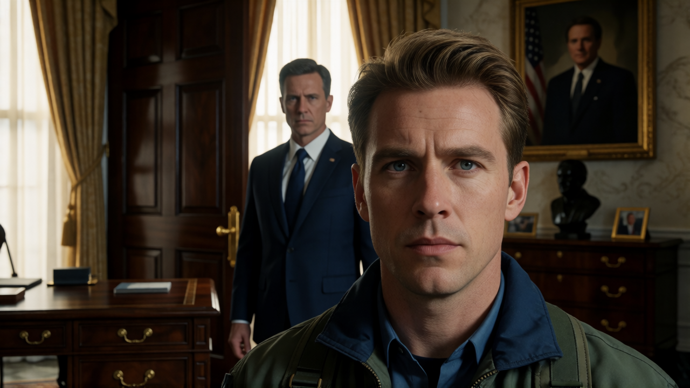

# Chapter 30: The Quiet Compromise

In the gilded heart of the Capital, the most lethal weapon wasn\'t a
sniper's bullet or a tactical warhead---it was a quiet signature on a
classified mandate. As Colonel Sean Walker and his team unearth a
subterranean horror buried beneath Vanguard's pristine laboratories,
they uncover a terrifying truth: Project Aegis isn\'t designed to save
humanity, but to leash it. Trapped between a sinister neural network and
a political machine desperate to bury the fallout, Sean must face the
darkest realization of all---that in a city built on compromise, even
victory can be rewritten as a cover-up.

--- 

 Secondary Characters
   

**President Thomas Callahan (Caspian Combine)**

 

A seasoned politician in his late fifties, President Thomas Callahan is a principled reformer caught in the suffocating web of deep-state politics, corporate lobbies, and military brass. Driven by a genuine desire to protect the Republic and restore institutional integrity, Callahan established the PCBI by Executive Order to uncover the truth behind Project Aegis. However, his vision is constantly paralyzed by the harsh realpolitik of the Capital. Recognizing that exposing the full depth of Vanguard’s conspiracy could trigger a systemic collapse or a military coup, Callahan operates as a cold, strategic pragmatist—forced to make ruthless compromises, trade silence for stability, and surrender his own political ambitions to keep the nation from tearing itself apart from within.

 Aegis Firmware Upgrade & Tactical Deployment Architecture 

#### **Data Ingestion & Telemetry Uplink Protocol (The Hookup)**

* **Internal Name:** *Near-Field Biometric Audit & Telemetry Sync (NFBATS)*
* **Mechanism:** When the subject connects to a clinic interface, charging dock, or near-field relay (e.g., a smart bed or diagnostic terminal), the nanorobots execute a **bulk optical/magnetic data dump** via sub-dermal transceivers.
* **Scientific Basis:** Biomemory arrays (using DNA-based digital storage or micro-ferroelectric RAM) store up to 24 hours of localized physiological and environmental telemetry in low-power states.

---

### **Stage 1: Passive Surveillance & Reconnaissance**

*Vanguard Cover Story: "Continuous Preventive Diagnostic & Epidemiological Mapping"*

#### **Phase 1: Sub-Dermal Biometric Profiling**

* **Medical / Technical Term:** *24-Hour Homeostatic & Biomarker Telemetry Sync*
* **Mechanism:** The nanorobots monitor biochemical indicators in the interstitial fluid and bloodstream—glucose levels, hormonal spikes (cortisol, adrenaline), metabolic waste, heart rate variability, and gene expression.
* **Function:** Tracks emotional states, stress triggers, fatigue, and health status in real time to detect if the subject is lying, anxious, or engaging in high-risk activity.

#### **Phase 2: Kinematic & Spatial Tracking**

* **Medical / Technical Term:** *Endovascular Triangulation & Micro-Inertial Navigation Systems (mINS)*
* **Mechanism:** Lacking direct satellite GPS inside the body, the nanobots use onboard micro-gyroscopes, accelerometers, and magnetic induction alignment relative to ambient terrestrial magnetic fields and local cellular towers/Wi-Fi beacons.
* **Function:** Reconstructs the subject’s precise movement history and spatial path over the previous 24 hours.

#### **Phase 3: Proximal Contact & Interaction Mapping**

* **Medical / Technical Term:** *Inter-Host Mesh Network Sensing & Peer Discovery*
* **Mechanism:** Using ultra-low-power **Near-Field Magnetic Induction (NFMI)**, nanobots emit micro-pulses that bounce off nanobots inside nearby individuals.
* **Function:** Logs every Aegis-inoculated person the subject came into physical or close contact with, creating a dynamic, real-time social/contact-tracing network for dissidents or operatives.

#### **Phase 4: Ocular Visual Capture**

* **Medical / Technical Term:** *Retinal Vitreal-Interface Micro-Array (Opto-Electronic Capture)*
* **Mechanism:** Nanobots migrate through the hyaloid canal into the vitreous humor and align along the nerve fiber layer of the retina. They capture light patterns focusing on the photoreceptors (rods and cones) and encode low-resolution optical data into biomemory.
* **Function:** Acts as a biological dashcam, recording everything the subject saw in the past 24 hours.

---

### **Stage 2: Neurological & Physiological Interdiction**

*Vanguard Cover Story: "Acute Neuro-Somatic Stabilization & Crisis Management Protocols"*

#### **Phase 5: On-Demand Sedation**

* **Medical / Technical Term:** *Targeted Blood-Brain Barrier (BBB) Neuro-Inhibition*
* **Mechanism:** Nanobots positioned near cerebral microcapillaries act as targeted drug delivery systems. Upon receiving an encrypted RF trigger, they rupture micro-vesicles carrying GABA-A agonists (like ultra-potent neuro-steroids or propofol analogs) directly into the thalamus and reticular activating system.
* **Function:** Induces instantaneous, controllable loss of consciousness ("fainting") without systemic chemical poisoning.

#### **Phase 6: Motor & Involuntary Muscle Paralysis**

* **Medical / Technical Term:** *Neuromuscular Junction (NMJ) Synaptic Blockade*
* **Mechanism:** Nanobots anchor to the motor endplates where motor neurons meet skeletal muscle fibers. They release micro-doses of acetylcholine receptor antagonists (similar to curare) or apply local electrical depolarization pulses to jam neuromuscular transmission.
* **Function:** Complete, rigid, or flaccid immobility. The subject remains fully conscious but completely incapable of moving or speaking.

#### **Phase 7: Induced Fatal Myocardial Infarction**

* **Medical / Technical Term:** *Focal Coronary Vasospasm & Cardiac Conduction System Disruption*
* **Mechanism:** 1. *Mechanical:* A swarm aggregates in the left anterior descending (LAD) coronary artery to form a temporary micro-thrombus (clot).
2. *Electrical:* Simultaneously, bots on the Sinoatrial (SA) and Atrioventricular (AV) nodes fire uncoordinated electrical micro-shocks, inducing Ventricular Fibrillation (V-Fib).
* **Function:** Causes sudden death. Autopsies show classic myocardial ischemia or sudden cardiac arrest, making it look entirely like a natural heart attack while the nanobots disassemble and dissolve post-mortem to erase physical evidence.

#### **Phase 8: Induced Psychosis & Cognitive Disruption**

* **Medical / Technical Term:** *Prefrontal-Limbic Neuro-Modulation & Dopaminergic Storm Injection*
* **Mechanism:** The nanobots cross the Blood-Brain Barrier to target the prefrontal cortex, amygdala, and hippocampus. They stimulate localized deep-brain electrical pulses while triggering the hyper-release of dopamine and glutamate, creating intense hallucinations, extreme paranoia, erratic mood swings, and cognitive fragmentation.
* **Function:** Discredits whistleblowers, politicians, or investigators by making them appear insane, mentally unstable, or unfit for public duty before they can expose the truth.

---

### Summary Table for Cyber-Docs

| Phase | Internal Codename | Targeted Biological System | Primary Mechanism / Tech | Plot Purpose |
| --- | --- | --- | --- | --- |
| **Phase 1** | *Bio-Audit* | Vascular / Endocrine | Metabolic & Cortisol Sensing | Lying / Stress Detection |
| **Phase 2** | *Kinematic-Trace* | Cardiovascular / mINS | Magnetic Triangulation | Pathing & GPS History |
| **Phase 3** | *Mesh-Discovery* | Sub-Dermal / NFMI | Peer-to-Peer RF Ping | Mapping Dissident Networks |
| **Phase 4** | *Ocular-Sync* | Retina / Vitreous Humor | Opto-Electronic Micro-Arrays | Visual Memory Recording |
| **Phase 5** | *Somnolent-Override* | Blood-Brain Barrier | GABA-A Micro-Vesicle Release | On-Demand Fainting/Sedation |
| **Phase 6** | *Motor-Lock* | Neuromuscular Junctions | Synaptic Acetylcholine Block | Total Physical Immobilization |
| **Phase 7** | *Ischemic-Term* | SA Node / Coronary Artery | Electrical V-Fib & Micro-Clot | Undetectable "Heart Attack" |
| **Phase 8** | *Dementia-Protocol* | Prefrontal Cortex / Amygdala | Neural-Spike & Neurotransmitters | Simulated Madness/Psychosis |

---   

## Scene 1: The Court of Public Opinion

In the cold, sterile war room of the Presidential Commission on
Bioethical Integrity, defeat did not arrive with the roar of an
explosion or the shatter of glass---it arrived in a sleek,
high-definition broadcast streamed to three billion screens across the
Capital.

Colonel Sean Walker stood near the primary holo-table, his arms folded
tightly across his chest, watching the smooth, perfectly curated smile
of Vanguard's chief spokesperson floating above the glass. On the screen
behind her, hyper-realistic, glowing medical renders showed micro-scale
swarms sweeping effortlessly through arterial walls, dissolving dark,
fibrous clots like morning mist under sunlight.

*"---introducing Project Aegis,"* the spokesperson announced, her voice
dripping with warm, reassuring empathy. *"A revolutionary leap forward
that transitions modern medicine from reactive diagnostic monitoring to
permanent, proactive cellular guardianship. Where the PCBI sees baseless
phantom conspiracies, Vanguard sees a future free from stroke, heart
failure, and terminal cancer."*

The broadcast cut seamlessly to a montage of dazzling success stories.

A seventy-two-year-old cardiac patient, who months ago could barely
climb a flight of stairs, was shown sprinting along a sunlit beach,
laughing as he picked up his young granddaughter. *"I felt like my body
turned back the clock twenty years in three days,"* he beamed toward the
camera. *"Aegis didn\'t just save my heart---it gave me back my youth."*
Next came a young mother, once classified as a terminal stage-four
oncology case, sitting in a lush backyard surrounded by her cheering
family. She held her husband\'s hand, tears of joy streaming down her
face. *"The doctors told me to say my goodbyes,"* she whispered into the
microphone. *"Then Vanguard's micro-tech swept every malignant cell from
my body without a single round of chemo. I get to watch my children grow
up."*

Sean let out a slow, heavy breath through his teeth. Across the table,
Dr. Elena Vance slammed her datapadd onto the console, the sharp crack
echoing through the quiet room.

"Baseless speculation," Elena muttered, her knuckles white where she
gripped the edge of the display. "They purged living micro-transceivers
out of patients' kidneys, blew three hundred thousand pristine VTX-709
doses into a cloud of liquid ammonia, and they're using heavily scripted
commercials to call our bio-forensic audit *speculation*?"

"They aren\'t fighting us in court, Elena," Captain Fedor Volkov said
without looking up from his workstation. His eyes were bloodshot,
reflected in the dark green cascade of encrypted dark-web telemetry he
had been sifting through for days. "They don\'t have to. Every server
tied to their offshore supply manifests went dark forty-eight hours
after the cryo-facility explosion. Financial trails? Wiped or buried
under sixteen layers of shell trusts in neutral territory."

Major Dimitri Sidorov turned around in his chair, rubbing his weary
face. "Six months," Dimitri said raspy-voiced. "Six months of following
phantom money trails, and every time we get close to a proxy bank,
Vanguard floods the holonet with another heart-wrenching recovery video.
They've wrapped themselves in the unassailable armor of a medical
miracle."

"It's not just a miracle---it's a legal trap," Sean said, his voice
dropping into a quiet, icy register. He tapped a side panel on the
holo-table, pulling up a document he had isolated from the Interstellar
Health Authority filings. "Look at the regulatory reclassification they
just slipped through."

Elena leaned over the glass, her brow furrowing. "They're expanding
Aegis from diagnostic micro-arrays to therapeutic bio-interventions?"

"Exactly," Sean said. "Under standard diagnostic protocols,
micro-nanobots must legally be flushed from the host's body within
forty-eight hours to prevent organ toxicity. That's why Vanguard
triggered that RF purge on their vaccine recipients ---to destroy the
evidence before we could sample it. But therapeutic classification
allows *indefinite residence*. If the nanobots are actively repairing
tissue or suppressing tumors, Vanguard gets the legal right to keep
micro-hardware inside human bodies permanently."

"And permanent hardware means a permanent data link," Fedor added,
bringing up a complex network schematic. "Once those transceivers take
up permanent residence, Vanguard can push over-the-air firmware updates.
Phase one is health monitoring. Phase two is vascular repair. But with a
background patch, those same nodes can be re-tuned to emit low-frequency
magnetic induction directly against the vagus nerve or prefrontal
cortex. Subject surveillance and subtle neural conditioning."

Elena gasped, a chill running through her. "They aren\'t just selling a
cure. They're building a silent, cellular leash."

"And look at how they keep the leash hidden," Sean said, pulling up a
copy of the Aegis patient agreement. He highlighted section nine in bold
red text. "Every patient who signs up for Project Aegis signs a
draconian legal release. Successful patients---like the ones smiling on
TV right now---are contractually required to market their recovery in
the press. But if the treatment fails? If the micro-tech causes organ
failure, neurological damage, or death?"

"Section Nine-B," Victoria read off the screen, her tone bitter. "An
ironclad non-disclosure agreement. Total forfeiture of public statement
rights, immediate revocation of ongoing medical care, and massive
financial penalties for families who speak out. The successes are
paraded on every news channel; the failures are legally gagged and left
to die in silence."

"They're burying the bodies under NDAs," Elena said, a cold shudder
running through her.

Before anyone could answer, the secure comms panel on the main wall
chimed with a harsh, synthetic warning tone. Red banners flashed across
the overhead monitors as line-item budgets for the PCBI's field
enforcement team began to blink in amber: **PENDING CONGRESSIONAL REVIEW
/ INJUNCTION FILED**.

Outside the high-security reinforced windows of the facility, the
muffled, rhythmic chants of thousands of protesters echoed up from the
plaza below---citizens holding glowing digital banners demanding the
PCBI stand down and stop blocking Vanguard's "miracle cure".

Sean turned away from the glass to face his exhausted team. They had
survived artillery fire, frozen trenches, and black-ops ambushes on the
frontier, but here in the Capital, the enemy hadn\'t needed a single
bullet. Vanguard was buying the world's gratitude, one manufactured
miracle at a time, while slowly building a cage around humanity.

---  

## Scene 2: Shadow Protocol

The encrypted terminal screen flickered to life in the darkened corner
of the PCBI war room, its interface disguised as a benign weather
telemetry node parsing barometric pressures over the Sirona basin.

**\[WEATHER_FORUM // NODE 07\]**

**RUBY:** *Sean, you have to stop them. You can\'t let Vanguard put
millions of citizens under a permanent cellular leash through Project
Aegis.*

**SEAN:** *I know. They've successfully frozen our operational mandate
under congressional review. Between the media blitz and the fake
recovery testimonials, they've completely won the court of public
opinion. We're legally bottled up.*

**RUBY:** *Then stop fighting them in Congress. Dig into Aegis from the
inside. Expose what that hardware is actually programmed to do.*

**SEAN:** *Their clinical facilities are air-gapped fortresses. I need
someone I can trust implicitly to walk through their front door and go
undercover as a trial subject.*

**RUBY:** *Do you remember Lila Voss?*

**SEAN:** *Your double from the Cygnus operation?*

**RUBY:** *The same. She's deeply grateful for the second chance we gave
her in Erden. She wants to make up for the life she lived under the
machine. I can convince her and Marcus to travel to Capital Vanguard.*

**SEAN:** *(Pauses, his fingers hovering over the keys)* *Make sure
you're completely off-grid when you make contact, Ruby. If Thorne or
Draven intercept the signal, it's a death sentence for all of you.*

**RUBY:** *I'm using an untraceable relay, funded by the dark currency
we stripped from Grim's offshore accounts. Lila and Marcus will have
clean identities, backed by enough capital to maneuver inside the
Capital without raising red flags.*

**SEAN:** *Brief them thoroughly. Make sure they understand the sheer
scope of the risk. Vanguard doesn\'t arrest infiltrators---they erase
them.*

**RUBY:** *I will. And Sean? You and Elena need to watch your backs.
With the PCBI's official immunity under review, Vanguard's contractors
won\'t hesitate to take a shot. Stay in the shadows.*

**\[THIRTY-SIX HOURS LATER // PCBI SAFE-HOUSE WAR ROOM\]**

The rain beat a steady rhythm against the reinforced glass of the safe
house as the heavy blast doors slid open.

Marcus Kane stepped into the light first, his sharp, vigilant gaze
scanning the perimeter of the room out of pure muscle memory. Beside him
stood Lila Voss, her dark coat pulled tight against the chill. Two years
of quiet life in the provinces had softened the harsh edge of their
former operative lives, but the quiet, unspoken bond between them was
unmistakable---they stood shoulder to shoulder, a unit forged in
survival.

\"I told her the Capital was a trap,\" Marcus said, his voice a low
rumble as he nodded toward Sean. \"But my wife wasn\'t about to let me
sit on the sidelines while Vanguard builds a global cage.\"

Lila offered a small, resolute smile, looking at Elena and Sean. \"We
spent years being disposable weapons for empires that treated us like
numbers, Colonel. For the first time in our lives, we get to choose our
own fight. We\'re doing this together.\"

Elena gestured toward the glass briefing table. \"We appreciate the
courage, but you need to understand what you\'re stepping into. Project
Aegis isn\'t just a clinic---it's a high-security intake grid.\"

Sean picked up a silver data chip from the console, holding it up
between two fingers. \"This is your entry ticket. When you register at
the intake center, claim that your medical history is stored on this
encrypted personal chip due to Erden's fragmented cloud architecture.
Because Vanguard's terminal won\'t be able to query Erden\'s remote
servers directly, their intake nurse will be forced to slot this chip
into an internal terminal to read your files.\"

\"And the chip isn\'t just carrying medical records,\" Captain Fedor
Volkov chimed in, tapping his console to project a 3D wireframe of the
chip\'s internal logic. \"It contains a polymorphic zero-day worm. The
moment they read the file, the worm will silently breach their
terminal\'s local sandbox, establish a encrypted reverse-shell backdoor,
and map their local network topology.\"

\"That's phase one,\" Elena said. She reached down and picked up a
sleek, flesh-toned prosthetic sleeve, laying it gently on the glass.
\"This is a micro-fluidic synthetic skin overlay. It's custom-molded to
Lila's forearm.\"

Lila leaned in, examining the microscopic pores and sub-dermal vein
patterns woven into the material. \"What happens when they take a
baseline blood sample or give me an injection?\"

\"The overlay seals seamlessly over your injection site using
bio-adhesive,\" Elena explained, demonstrating how the flexible membrane
sat against skin. \"Inside the overlay are two isolated, pressurized
micro-fluidic chambers. When Vanguard's automated phlebotomy needle
pierces the synthetic vein for a baseline test, it draws from the clean
reservoir---never reaching your actual bloodstream. Their bio-scanners
will read you as a textbook, uncorrupted candidate for Aegis, completely
masking your natural immunity signatures.\"

Elena pointed to a tiny, dark micro-valve set into the back of the
sleeve. \"If they inject you with the Aegis treatment, the needle
bypasses your vein entirely and enters the second chamber. A
micro-vacuum inside the sleeve draws the entire dose into a hermetically
sealed, cryo-stabilized internal ampoule. It locks down
immediately---neutralizing any RF telemetry signals so Vanguard can\'t
detect that the nanobots haven\'t entered a host.\"

Elena looked up at Lila, her voice filled with quiet intensity. \"When
you bring that sleeve back, I won\'t just have telemetry or purged
waste. I\'ll have a live, active sample of Vanguard\'s raw nanobot
payload straight from their delivery needle. We\'ll finally be able to
reverse-engineer their firmware and prove to Congress exactly what
Project Aegis is doing to the public.\"

Sean turned to Marcus, handing him a slim, lightweight datapad that
looked identical to the standard administrative tablets used throughout
Capital hospitals.

\"Your job is perimeter intelligence,\" Sean instructed. \"While Lila is
in the intake chair, keep this tablet active. As you move around the
waiting room and hallways, the concealed wide-spectrum RF sniffer inside
will record Vanguard's local electronic fingerprints, harvest near-field
keycard encryption codes, and attempt to clone the terminal\'s operating
system environment.\"

Brand stepped forward, placing a small, heavy metal cylinder---no larger
than a marker---into Marcus's palm.

\"And if the intake grid flags your credentials and security closes the
doors?\" Brand said, his face stern. \"Twist the cap on this canister
and slam it onto the floor. It releases a hyper-dense, pressurized
aerosol solvent. The moment it hits the room\'s oxygen, it causes an
instantaneous optical bloom---blinding their security cameras and
thermal sensors while filling the hall with opaque chemical smoke. It'll
trigger the fire suppressants and buy you sixty seconds of pure chaos.
Head straight for the main concourse---we'll have an armored extraction
shuttle idling three blocks away.\"

Marcus slipped the canister into his inner jacket pocket, his jaw
tightening as he met Sean\'s eyes. \"Sixty seconds. We\'ve made exits on
less.\"

\"Keep your eyes open, both of you,\" Sean said, extending his hand to
Marcus and then Lila. \"Vanguard thinks they've backed us into a corner.
Let\'s show them what happens when they leave a crack in their wall.\"

---   

## Scene 3: The Cold Simulation

### Part 1: Unearthing the Grid

A week of sleepless silence had turned the PCBI war room into a
claustrophobic cavern of low hums, stale coffee, and flickering green
holograms.

Captain Fedor Volkov leaned over his console, his bloodshot eyes
reflecting thousands of lines of tumbling dark-web code. \"The worm Lila
planted finally called home. When Vanguard's local intake network pinged
external regional hospitals to auto-populate patient records, our
payload hijacked the handshake protocol. I\'m mapping their local
network topology now, but their central classified mainframe is buried
behind a multi-layered quantum encryption wall. I need more time to
breach it.\"

\"We already have what we need to locate their black site,\" Anya said,
bringing up a 3D volumetric wireframe of Vanguard's Capital flagship
facility. \"I parsed the passive structural telemetry Marcus's datapad
probe gathered while he was pacing the intake perimeter.\" She expanded
a subterranean section highlighted in pulsing crimson. \"His sensor
sweep detected an unlisted, sub-basement bunker. Thermal and
bio-electric imaging confirmed thirty-six containment capsules\... with
twenty-six active human vital signatures.\"

\"Twenty-six human guinea pigs,\" Sean said, his voice dropping into a
hard, dangerous register as he stepped beside her.

\"I cross-referenced those vital signatures against the Capital Police
Department\'s missing persons database,\" Anya continued, swiping a list
of mugshots across the glass. \"They're all unhoused citizens, transient
workers, and undocumented immigrants---people Vanguard knew wouldn\'t be
missed if they vanished off the streets.\"

Dr. Elena Vance walked over from the adjoining bio-containment lab,
snapping off a pair of rubber gloves. \"They aren\'t just housing
them---they're using living human hosts to fine-tune their next
nanorobot firmware upgrade. I've secured the live nanobot sample Lila
extracted inside an advanced Human Patient Simulator within a
signal-shielded Faraday chamber.\"

Elena tapped her tablet, bringing up a real-time synthetic autonomic
reading. \"The simulator emulates full physiological human organ
responses to micro-bot payloads. If Anya can replicate Vanguard\'s
hardware interfaces and Fedor can extract their raw firmware patches
from the mainframe, we can run a full dark simulation right here in the
room. We'll see exactly what Aegis does to a human body before Vanguard
deploys it to three billion citizens.\"

\"There\'s a physical entry point,\" Anya added, zooming into the
building's foundation schematics. \"Marcus's probe picked up an unmapped
service conduit beneath the sub-basement. Cross-referencing it with the
Capital\'s municipal water blueprints, it aligns with a disused city
sewage access tunnel. Vanguard is using it to quietly shuttle
unauthorized equipment and human subjects past surface security.\"

Sean turned to Brand. \"Brand, map an insertion route through those
sewers. We need physical access to that medical bay.\"

Brand's jaw set like iron. \"Consider it done, Colonel.\"

### Part 2: Infiltration (Seven Days Later)

The stench of stagnant water and industrial runoff was suffocating
inside the pitch-black sewage access tunnel.

A city municipal maintenance truck, retrofitted with muffled electric
drives, sat idling in the gloom. Sean, Elena, Anya, and Brand jumped out
of the rear doors, dressed in black tactical coveralls beneath muted
orange utility vests, their faces slick with sweat.

Sean tapped his earpiece. \"Fedor, we're at the sub-basement access
hatch.\"

*"I've bypassed their magnetic deadbolts and looped the local CCTV feeds
on an eight-minute buffer,"* Fedor's voice crackled through static over
the comms. *"The door is open. But Vanguard's automated system runs a
hard diagnostics sweep every ten minutes. You have precisely eight
minutes before the security loop resets. Go."*

Brand pried open the heavy steel access hatch, and the team slipped
through into the subterranean medical bay.

The room was bathed in an eerie, pale blue luminescence. Arranged in two
clean rows were thirty-six glass medical pods. Twenty-six of them were
occupied by emaciated, unconscious human subjects, their chests rising
and falling in shallow, sedated rhythm. Above each pod, glowing 3D
holographic telemetry panels displayed real-time bio-data, neural
activity graphs, and micro-bot concentration levels. Ten pods stood
empty---their glass frosted with dried chemical residue.

\"Clock\'s ticking. Less than seven minutes,\" Sean ordered quietly,
unslinging his rifle to cover the primary security door. \"Get to
work.\"

Anya moved with practiced precision, opening the main diagnostic
console. She pulled duplicated control modules from her pack---exact
physical replicas engineered at PCBI HQ from Marcus\'s probe
telemetry---and swapped them with Vanguard's live units. The swap was
seamless; Vanguard's surface technicians wouldn\'t detect the
modification until the units were sent in for routine servicing.

Beside her, Brand moved down the line of pods, inserting physical
hardware worms directly into each capsule\'s fiber-optic diagnostic
port.

Elena drew a multi-sample phlebotomy kit from her chest rig. She stepped
to the nearest pod, pressing a sterile vacuum needle into the subject\'s
central venous line to draw dark, micro-bot-saturated blood, while her
datapadd scanned the subject\'s local intake file.

\"My God, Sean\...\" Elena whispered, horror tightening her chest as she
read the scrolling telemetry. \"They aren\'t treating them. They're
running them through living stress tests---testing phased firmware
updates for ocular visual capture, motor paralysis, and full central
nervous system overrides.\"

\"Don\'t read it now, Elena,\" Sean said sternly, monitoring the door\'s
digital timer: **01:42 REMAINING**. \"Clone the raw patient logs
directly onto the chips!\"

Sean stepped up to the master pod console, jamming data-cloning keys
into the remaining interface slots. The datapadd chimed as raw gigabytes
of experimental medical records, firmware logs, and patient history
streamed into PCBI's encrypted drives while simultaneously implanting
Fedor\'s background surveillance worms.

*"Thirty seconds, Colonel!"* Fedor warned sharply over the radio.
*"Security sweep is initiating! Move now!"*

\"Clear!\" Anya barked, snapping the last module back into place.

\"Got the samples!\" Elena pulled the last vial, sealing her kit.

They scrambled back through the steel hatch, sealing the heavy door
behind them just as the red warning beacons on Vanguard's interior wall
flashed for the automated security sweep.

### Part 3: The Unveiling (Ten Days Later)

For seven straight days and nights, the PCBI war room had been locked
down under maximum security protocols. Blinds were drawn, comms were
hardened, and the air was thick with the ozone hum of the Human Patient
Simulator running inside the glass Faraday cage.

Sean stood at the head of the tactical table, looking at his exhausted,
red-eyed team.

\"Fedor managed to crack their central classified mainframe forty-eight
hours ago,\" Sean began, gesturing toward the main holographic
projection wall. \"Using the firmware payloads he extracted alongside
the patient blood samples Elena gathered from the sub-basement, we've
successfully re-created Vanguard's entire Aegis testing environment
inside our simulator.\"

Elena stepped forward, tapping her console. The holographic projector
materialized a life-sized, translucent human circulatory and nervous
system. Billions of microscopic, glowing gold micro-nodes swarmed
through the arterial branches and brain stem.

\"We have mapped Vanguard\'s full firmware upgrade architecture,\" Elena
announced, her voice calm but laced with absolute dread. \"It is
structured into two stages, encompassing eight distinct operational
phases.\"

She highlighted the first four micro-node swarms:

\"**STAGE 1: SUBJECT SURVEILLANCE & RECONNAISSANCE**

- **Phase 1 (Biometric Profiling):** The micro-transceivers map 24-hour
  homeostatic telemetry---monitoring heart rate variability, hormone
  spikes, and metabolic biomarkers to continuously track the host\'s
  stress, truthfulness, and emotional states.

- **Phase 2 (Kinematic Triangulation):** Using micro-inertial sensors
  and ambient magnetic alignment, the nanobots map the subject's precise
  GPS movements and physical pathing over the last twenty-four hours.

- **Phase 3 (Inter-Host Mesh Networks):** Near-field magnetic induction
  allows nanobots to \'ping\' bots inside nearby citizens, logging every
  Aegis recipient the subject comes into contact with to build a
  real-time social contact map.

- **Phase 4 (Ocular Visual Capture):** Nanobots migrate through the
  vitreous humor and align along the nerve fiber layer of the eye,
  encoding visual patterns focused on the retina to record everything
  the host saw in the last day.\"

Elena tapped the screen again, and the glowing nodes on the simulation
turned a dark, aggressive crimson.

\"**STAGE 2: NEUROLOGICAL & PHYSIOLOGICAL CONTROL**

- **Phase 5 (On-Demand Sedation):** Upon receiving an encrypted RF
  signal, nanobots at the Blood-Brain Barrier release targeted GABA-A
  neuro-inhibitors directly into the thalamus, causing the host to
  instantaneously faint.

- **Phase 6 (Neuromuscular Blockade):** Bots anchored to skeletal motor
  junctions release acetylcholine antagonists, inducing complete, rigid
  physical immobility while keeping the subject fully conscious.

- **Phase 7 (Induced Myocardial Infarction):** Nanobots aggregate inside
  the left anterior descending artery to form a temporary clot while
  micro-shocking the sinoatrial node, inducing sudden fatal cardiac
  arrest that is biologically indistinguishable from a natural heart
  attack.

- **Phase 8 (Psychotic Neuro-Modulation):** Nanobots cross into the
  prefrontal cortex and amygdala, triggering massive dopamine-glutamate
  spikes and localized electrical pulses to simulate severe paranoia,
  extreme hallucinations, and acute madness---discrediting
  whistleblowers before they can speak.\"

Silence hung thick over the war room.

\"They aren\'t offering a cure,\" Sean said softly, staring at the
crimson simulation. \"They\'re turning the entire human population into
a remote-controlled, monitored herd.\"

\"And look who ordered Stage 2,\" Fedor said, pulling up a deeply buried
technical master spec file he had ripped from Vanguard's mainframe.
\"The architecture authorization for the neurological control phases was
personally signed off by General Kincaid of the High Command. His
digital signature is embedded straight into the firmware source code.\"

\"Kincaid isn\'t smart enough to design a biological leash like this,\"
Sean said flatly. \"He's just a high-ranking cutout shielding his true
corporate masters.\"

Major Dimitri Sidorov stepped up, tossing a dense financial dossier onto
the center glass. \"And I just found the leash on Kincaid. His wife owns
three offshore holding trusts in neutral territory, routed through nine
proxy shell companies. Over the last eighteen months, Vanguard
Therapeutics has funneled forty-two million credits directly into those
accounts.\"

Sean looked around at his team---tired, battered, but holding the
absolute truth in their hands.

\"Good work, everyone,\" Sean said, his voice laced with unyielding
resolve. \"We have the bio-forensic proof, the technical firmware source
code, and the financial paper trail. It's time to bring President
Callahan into the loop and get a federal search warrant to raid that
underground medical bay before Vanguard realizes their system is leaking
and burns the evidence.\"

---  

## Scene 4: The Currency of Compromise

### Part 1: The Oval Office

The Oval Office was silent except for the low, rhythmic hum of the
atmospheric scrubbers. Dusk was settling over the Capital, casting long,
dark shadows across the polished mahogany of the Resolute Desk.

President Callahan stood by the bulletproof glass, staring out at the
illuminated monument in the distance, a half-empty glass of rye resting
in his hand. Floating above his desk was the 3D volumetric wireframe
Sean had brought---a pulsing red map of the eight-phase Aegis firmware,
backed by Kincaid's digitized signature and Vanguard's offshore
financial trails.

Callahan let out a long, slow breath, the lines on his face looking
deeper than they had six months ago.

\"Eight phases,\" Callahan said softly, without turning around. \"Visual
capture. Neuromuscular lock. Induced cardiac failure. You've handed me a
political nuclear warhead, Colonel.\"

Sean stood at rigid attention across the desk, his jaw set like iron.
\"Mr. President, we have the forensic proof, the source code, and the
victims in that sub-basement. We need federal marshals to raid that
facility tonight, seize Vanguard's primary servers, and arrest Kincaid
before they erase the infrastructure.\"

Callahan turned around slowly, setting his glass on the desk. His
expression wasn\'t angry---it was hauntingly unreadable.

\"And what happens tomorrow, Sean?\" Callahan asked, his voice low and
raspy. \"When the public learns that the national health initiative they
willingly injected into their arms contains a neural leash? When the
military High Command realizes their top general is about to be dragged
through a public tribunal? The stock markets will collapse by morning.
Half the military districts will refuse orders. The Capital will burn.\"

\"So we do nothing?\" Sean's voice edged with sharp, controlled fury.
\"We let them keep the leash on?\"

\"I am going to handle this *quietly*,\" Callahan replied, leaning
forward against the desk, meeting Sean's gaze with unflinching pragmatic
coldness. \"Vanguard will halt the Aegis rollout. Kincaid will be
stripped of his operational command behind closed doors. The black-site
subjects will be transferred to a private military hospital for
\'rehabilitation.\'\"

\"That's a cover-up, sir,\" Sean said flatly. \"They'll just bury the
evidence and wait for the next administration.\"

\"I am walking a tightrope over a razor's edge, Colonel!\" Callahan
snapped, the quiet composure cracking for a single brief second before
he smoothed his tie. \"I am balancing four corporate blocs, a hostile
Senate, and a military High Command that controls three orbital fleets.
You brought me a fire. I am choosing to smother it before it consumes
the Republic.\"

Callahan paused, pulling a leather-bound folder from his drawer. \"I
won\'t be running for a second term. I've already informed the party
committee. I'm stepping down at the end of the year.\"

Sean's brow furrowed, a cold knot tightening in his chest. \"Then what
happens to the PCBI? What happens to the warrants we've drafted?\"

\"The PCBI was created by Executive Order to give the public an
answer,\" Callahan said smoothly, shutting the folder. \"Its mission is
officially\... fulfilled. I won\'t dissolve it with a flourish---I'll
simply let its operational mandate expire under congressional review.
I\'ll leave its ultimate disposition to my successor.\"

Callahan looked at Sean, his eyes softening with a sliver of genuine
pity. \"Take your team off the board, Sean. Stand down. Take a leave of
absence. Go somewhere far from the Capital. You've done your duty.\"

Sean stared at the President for a long, heavy moment. He didn\'t
salute. He simply gave a sharp, formal nod and turned toward the heavy
oak doors.

\"Colonel,\" Callahan called out just as Sean reached the handle. \"You
survived the frontier because you knew when to shoot. You'll survive
this city only if you know when to walk away.\"

Sean didn\'t answer. He opened the door and stepped out into the cold,
marble corridors of power.

### Part 2: The Official Narrative

**\[ONE WEEK LATER // CAPITAL BROADCAST NETWORK\]**

The ambient holo-screen inside a quiet Capital café droned in the
background, a polished anchorperson speaking over crisp, sanitized
infographics:

*\"\...In national news, Vanguard Therapeutics announced this morning
the voluntary suspension of Phase III clinical trials for Project Aegis,
citing an overwhelming surplus of intake data and successful baseline
benchmarks. In a press release, Vanguard\'s Chief Executive Officer
announced his decision to step down to pursue personal philanthropic
endeavors\...\"*

The broadcast cut to a formal military ceremony at the Pentagon:

*\"\...Meanwhile, the Department of Defense celebrated the early
retirement of General Marcus Kincaid today. Senior officials praised
Kincaid's four decades of distinguished service to the armed forces,
awarding him the Distinguished Service Cross during a closed-door
ceremony at High Command headquarters\...\"*

### Part 3: Shadows in the Forum

Late that night, in the dark sanctuary of a secure safe-house apartment
overlooking the rain-slicked towers of the Capital, Sean sat in front of
a hardened, low-power terminal. The screen flickered, masking his
transmission behind an automated barometric weather feed parsing
rainfall averages in the Sirona basin.

**\[WEATHER_FORUM // NODE 07\]**

**RUBY:** *I saw the news network feed. Kincaid gets a medal and a
pension, and Vanguard gets a tax write-off. Was Callahan part of it all
along?*

**SEAN:** *No. If Callahan were in Vanguard\'s pocket, he never would
have granted us executive subpoena power for the PCBI in the first
place. He was just a politician trying to manage the blast radius.*

**RUBY:** *He used you, Sean. He needed a decorated hero to give the
PCBI teeth so Vanguard and High Command would take his threats
seriously. Now that he's leveraged your findings to force a quiet
stalemate, he's cutting the cord.*

**SEAN:** *It wasn\'t just public opinion. Callahan is stepping down.
The deep state in this city has tentacles deeper than the presidency. If
he pushed for public indictments, they would have removed him before the
trial started.*

**RUBY:** *What are you going to do with the team?*

**SEAN:** *Once the PCBI's budget is officially frozen next week, I'm
routing Elena back to Cygnus under a private research grant. She knows
too much about the nanobot architecture. Once she\'s back in neutral
territory, I need you to keep a personal watch on her.*

**RUBY:** *I'll cross-reference the dark-web contractor forums and
shadow broker target lists. If Vanguard or Kincaid\'s proxies put a
bounty on you or Elena after the commission dissolves, I'll spot it
before the hitmen leave the gate. But Sean\... you\'re staying in the
Capital alone. Without official immunity, you\'re an unguided missile in
their backyard.*

**SEAN:** *I\'m not leaving Fedor, Brand, or Dimitri behind. If the
machine comes for us, it\'ll have to go through me first.*

**RUBY:** *(A long pause before the text appears)* *Whatever you
need---funds, extraction routes, dark-currency relays---just say the
word. I won\'t let them erase you, Sean. Not after everything we've
survived.*

**SEAN:** *Stay safe, Ruby. The storm isn\'t over---it's just changing
direction.*

The Weather Forum window dissolved into raw barometric curves and
temperature arrays, scrubbing its flash memory clean.

Sean stood up, turning off the terminal. He walked to the
floor-to-ceiling window and looked out at the glittering, cold skyline
of Capital Vanguard. High above the spires of steel and glass, the stars
burned silently in the dark void---distant, indifferent, and beautiful.

He rested his hand against the cold glass, his jaw set like iron. The
war in the trenches was over, but in the shadows of this gilded city,
the real fight for survival had only just begun.

---   
  
[Sample Video](https://youtu.be/Jmhc087STPY)  

**Scene: Project Aegis Exposed!** 

In this thrilling scene from this Chapter, Dr. Elena Vance and Colonel Sean Walker uncover the terrifying reality behind Vanguard Therapeutics’ Project Aegis. Inside a covert subterranean medical facility, twenty-six human subjects are subjected to a multi-phase nanorobot firmware upgrade—enabling total central nervous system control, ocular visual capture, and remote physiological overrides.

With an automated security countdown ticking away and President Callahan facing impossible political choices, watch as the truth is pulled into the light... only to be swept under the rug by the powers that be.

Dialogue Script:

Elena (Voice trembling, breathless horror): "My God, Sean... They aren't treating them. They're running them through living stress tests—testing phased firmware updates for ocular visual capture, motor paralysis, and full central nervous system overrides."

Sean (Stern, urgent, low command voice): "Don't read it now, Elena. Clone the raw patient logs directly onto the chips!"

---  

  
[Sample Video](https://youtu.be/Jmhc087STPY)  

**Scene: YOU SURVIVED THE FRONTIER... CAN YOU SURVIVE THIS CITY?** 

In this dramatic chapter , Colonel Sean Walker delivers undeniable proof of Vanguard Therapeutics’ neural-override project directly to the Oval Office. But President Thomas Callahan delivers a chilling reality check: exposing the truth would spark systemic collapse and military rebellion. Forced to make a ruthless political compromise, Callahan chooses to smother the scandal—retiring General Kincaid behind closed doors, dissolving the PCBI, and leaving Sean with a bitter ultimatum.

Dialogue Script:

Callahan (Quiet, weary voice): "Take your team off the board, Sean. Stand down. Take a leave of absence. Go somewhere far from the Capital. You've done your duty."

Callahan (Voice echoed, warning tone): "Colonel... You survived the frontier because you knew when to shoot. You'll survive this city only if you know when to walk away."

---  
[Previous Chapter](./ch29.md)

