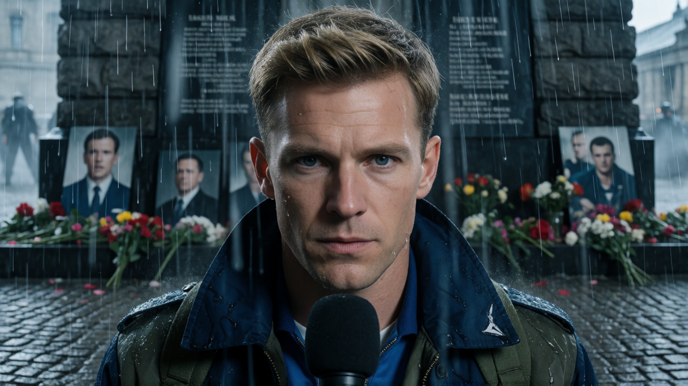
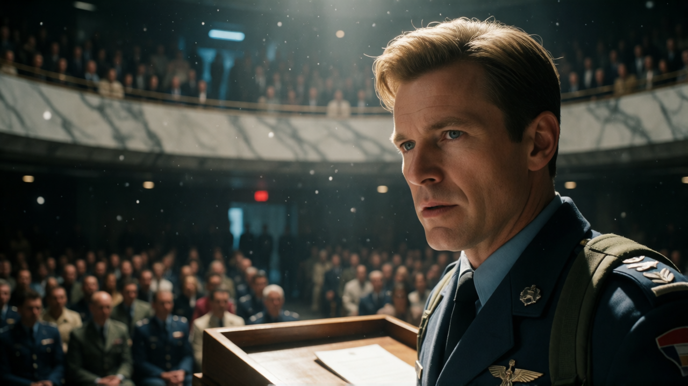

# Chapter 32: The Razor’s Edge of Peace

---  

To govern a conquered land, a man must choose between the whip and the
mantle---between ruling through fear or bearing the crushing weight of a
people's grief. In the wake of General Garrick's iron-fisted tyranny,
Colonel Sean Walker steps into the ashes of East Erden not as an
oppressor, but as a silent shield. But as the long-awaited Referendum
approaches and imperial forces mass at the border, Sean is forced to
play a razor-thin game of political chess: persuading a city that
despises his uniform to hold its fire, stay its hand, and use the
empire's own armor to buy their freedom tomorrow.

---

 Historical Precedents: The Power of Symbolic Atonement and Strategic Restraint

  
Leaders throughout history have faced moments where military force or political rhetoric was insufficient to heal a fractured state. In these high-stakes crucibles, progress required a single, dramatic act of moral humility—or tactical restraint—to disarm enemies, restore legitimacy, and prevent imminent violence.

**The Kneefall of Warsaw (*Warschauer Kniefall*), 1970**
* **The Catalyst:** Decades after WWII, tensions remained deeply burnt into the fabric of Eastern Europe. During a state visit to Poland to sign the Treaty of Warsaw, West German Chancellor Willy Brandt visited the monument to the 1943 Warsaw Ghetto Uprising.
* **The Act:** Unscripted and unexpected, Brandt—a staunch anti-Nazi exile who personally held no guilt for the regime's crimes—spontaneously fell to his knees before the memorial in silent penance.
* **The Impact:** The image echoed across the globe. By humbling himself on behalf of his nation, Brandt achieved what years of formal diplomacy could not: he shattered the moral barrier between West Germany and Eastern Europe, laid the groundwork for *Ostpolitik* (reconciliation), and proved that genuine accountability is a leader's strongest weapon.

**French Recognition of Systematic Torture in Algeria, 2018**
* **The Catalyst:** The Algerian War of Independence (1954–1962) left deep, unhealed wounds in both nations, shrouded in decades of official state denial regarding the systemic torture and forced disappearances carried out by French forces.
* **The Act:** French President Emmanuel Macron formally acknowledged that the French state had installed a system that permitted torture during the war, specifically taking responsibility for the death of anti-colonial activist Maurice Audin.
* **The Impact:** While politically risky and heavily criticized by right-wing factions at home, the admission broke a 60-year taboo. It shifted the state's posture from defensive denial to historical truth-telling, depriving extremist factions of their primary narrative of ongoing state hypocrisy.

**The Peaceful Resolution of the Leipzig Monday Demonstrations, 1989**
* **The Catalyst:** As the East German regime crumbled, tens of thousands of pro-democracy protesters gathered in Leipzig. The Communist government deployed heavily armed police, paratroopers, and live-ammunition units, setting the stage for a bloody crackdown reminiscent of Tiananmen Square.
* **The Act:** Local figures—including musicians, regional party officials, and clergy—issued desperate public appeals for non-violence, while civilian leaders strategically instructed the massive crowd to remain entirely peaceful, offering no pretext or provocation for military intervention.
* **The Impact:** Deprived of any violent incidents or "rioting" to justify a state of emergency, the armed security forces stood down. The peaceful march proceeded unbroken, signaling the end of the regime's moral authority and directly accelerating the fall of the Berlin Wall weeks later.

---

### **Key Takeaway for Regional Governors**

> *"A tyrant uses armor to force compliance; a true statesman uses radical accountability to disarm hatred. When an occupier kneels, or when a crowd refuses to throw the first stone, the enemy's pretext for violence evaporates into air."*

  

---  

Historical Precedents: The Fragile Geometry of Referendums

 
  
A referendum is a double-edged tool of political sovereignty—a mechanism designed to give public will the force of law, yet frequently weaponized, contested, or ignored by imperial powers. Throughout world history, self-determination votes have drawn the line between peaceful democratic evolution and civil war.

**The Quebec Independence Referendums (Canada, 1980 & 1995)**
* **How It Began:** Driven by decades of cultural, linguistic, and political tension between Francophone Quebec and the English-speaking federal government, the provincial government held two historic votes on whether Quebec should secede from Canada to become a sovereign state.
* **How It Ended:** Both attempts failed to achieve independence, but the 1995 vote resulted in one of the narrowest margins in democratic history (50.58% "No" vs. 49.42% "Yes"). The razor-thin victory for the federal status quo preserved the nation's borders, led to legal frameworks regarding future secession rules (the *Clarity Act*), and granted Quebec greater provincial autonomy without a single shot being fired.

**The United Kingdom European Union Membership Referendum ("Brexit", 2016)**
* **How It Began:** What began as an internal political gamble by the British Prime Minister to quiet nationalist factions turned into a binding national vote on whether the UK should leave the European Union.
* **How It Ended:** The "Leave" campaign won by a narrow 51.9% margin, triggering years of severe political upheaval, trade disruptions, economic realignments, and intense constitutional debate regarding the Northern Irish border. It demonstrated how a simple majority vote on a complex geopolitical tie can permanently rewrite a nation's global standing.

**The Catalan Independence Referendum (Spain, 2017)**
* **How It Began:** Following years of disputes over regional tax contributions and cultural rights, the autonomous government of Catalonia organized a vote on October 1, 2017, to break away from Spain and declare a republic.
* **How It Ended:** The central Spanish government in Madrid declared the referendum unconstitutional under the 1978 Constitution. Spanish national police were deployed to seize ballot boxes and shut down polling stations, resulting in violent clashes. Although local organizers claimed a overwhelming "Yes" vote among those who cast ballots, the central government suspended Catalan autonomy, arrested regional leaders for sedition, and forced the independence movement underground.

---

### **Key Takeaway for Regional Governors**

> *"Referendums rarely solve political divides on their own; they expose the raw balance of power. A vote for independence without the military force or economic self-sufficiency to back it up almost always invites central intervention."*

---

  

---    

## Scene 1: The Bow and the Vow

The shadow of the Capital loomed long over East Erden, but inside the
District Courthouse, Judge Maria Santos did not flinch. Despite the
mounting threats from High Command, the trial proceeded---a quiet,
ruthless accounting conducted in the chilling absence of General
Garrick. When the verdict fell thirty days later, it struck the marble
floor like an iron hammer: *Guilty of crimes against humanity and
unauthorized martial execution.*

In the gilded halls of Capital Vanguard, officials recoiled, instantly
denouncing the East Erden bench as a \"kangaroo court\"---a rogue
tribunal masquerading as law, void due to the absence of the accused.
They formally denied extradition and sealed Garrick's classified service
record.

But the people of East Erden were deaf to the Capital's outrage. In a
quiet, devastating act of civilian defiance, the city transformed
overnight. Garrick's face was plastered across every alley, transit hub,
and concrete pillbox. Everywhere one looked, his cold, severe eyes
stared back, stamped with a single word in bold, stark black ink:
**WANTED**.

By the morning of April fourth, Althea Plaza had become a sea of quiet
grief.

Wreaths, woven pine branches, and guttering tallow candles formed a vast
mosaic around the central memorial. Photos of the fallen were pinned to
the stone---young faces frozen in time. For decades, this monument had
belonged to state propaganda: regimented military parades, polished
brass bands, and calculated displays of imperial pride for the officers
who kept order. But since the April Fourth Massacre under Garrick\'s
command, the plaza had been silenced by emergency decree.

Today, Colonel Sean Walker intended to break that silence.

He walked into the open plaza wearing his standard Combine utility coat.
No ceremonial medals. No velvet trim. He was flanked only by two local
militia guards, their rifles slung behind their backs with empty
chambers---a quiet testament to peace rather than an enforcement of
power.

The central memorial was already overwhelmed, dominated by a massive,
iron-framed wreath bearing the names of the university students
slaughtered in the initial purge. Seeking no grand entrance, Sean veered
toward an unadorned edge of the stone base, carrying a simple,
hand-bound bundle of white winter lilies.

Then, a sudden, bitter gale ripped across the open plaza.

The wind caught the top-heavy iron frame of the main memorial. With a
sickening, metallic groan, the heavy arrangement overturned, tumbling
onto the wet cobblestones. Photos scattered; porcelain vases shattered.

Before the guards or citizens could step forward, Sean was on his knees
in the slush.

His bare hands were red from the cold as he gathered the shattered glass
and lifted the heavy iron frame back onto its stone pedestal. He
re-anchored the fallen photographs, wiping the dirt from the faded
plastic sleeves with his thumb.

He stood up, took three precise, measured steps back, and stopped.

Then, Sean bowed.

It was not a light head-nod of military protocol. It was a formal,
ninety-degree bow---a deep, unyielding posture of absolute contrition.
He held the stillness for ten agonizing seconds, suspended in front of
the names of the dead.

In the crowd, the murmuring died instantly. Hundreds of eyes locked onto
the solitary figure in the Combine uniform. An officer of the occupying
power, bowing to the victims of his own state.

As if reacting to his stillness, the gray clouds above broke open. A
freezing, torrential rain began to lash Althea Plaza, soaking through
wool coats and stinging bare skin. Nobody moved. The crowd stood frozen,
watching the water pool at Sean\'s feet as he straightened his spine and
stepped up to the modest wooden lectern.

Sean gripped the edges of the wet wood. His voice was raw, stripped of
military cadence, but it cut cleanly through the sound of the downpour.

"We come here today because we cannot forget," Sean said. "We do not
dare to forget. We will never allow the names written here to be washed
away by convenience or redacted by executive decrees."

Rain streamed down his face, pooling in the collar of his coat. Across
the plaza, tears mixed invisibly with the downpour on the cheeks of
mothers, brothers, and veteran soldiers.

"We remember those who stood when the ground beneath this city
trembled," Sean continued, his eyes scanning the sea of wet, upturned
faces. "We honor those who fought for a justice that seemed lost in the
dark, and those who gave their final breath so that the rest of us might
draw ours in truth. They did not die for a flag, nor for an empire. They
died holding the line for each other."

Sean leaned closer to the microphone, his knuckles white against the
lectern.

"Garrick's regime sought to teach us that human life is
disposable---that law is merely whatever the man with the gun says it
is. If we respond to his cruelty with our own unchecked vengeance, then
General Garrick has won. He will have remade us in his image."

He paused, letting the weight of the words settle over the silent crowd.

"Today, we dismantle his legacy---not with fire, but with the law.
Effective immediately, under my authority as Regional Military Commander
and in coordination with the East Erden Transition Council:

**First:** All emergency decrees, curfews, and martial law protocols
enacted under General Garrick are hereby permanently revoked.
Jurisdiction over civilian life is fully restored to the East Erden
Judiciary.

**Second:** A total, unconditioned amnesty is granted to all political
prisoners, journalists, and dissenters detained under illegal security
mandates. The gates of the central detention facility are being opened
at this very hour.

**Third:** All local assets, corporate holdings, and black-budget funds
seized by Garrick's command are frozen and transferred into a public
restitution fund, overseen by Judge Santos and civilian oversight
boards, to rebuild our schools, hospitals, and homes.

**Fourth:** To those in the Capital who claim these proceedings violate
imperial procedure---hear this clearly. These actions do not defy the
law; they restore it. We do not stand in rebellion against order; we
stand against the perversion of it. If the High Command wishes to audit
East Erden, let them come and inspect our courtrooms, not our
graveyards."

Sean took a deep breath, his chest rising and falling against the cold
rain.

"Let us carry the memory of the fallen in every heartbeat, but do not
allow grief to become a prison. Do not allow hatred to blind your
vision, or sorrow to drain your strength. We must move forward---not
with the blinding fire of revenge, but with the enduring passion of
purpose.

Today, we do not stand as factions, as soldiers or insurgents, as
Combine or Erden.

Today, we stand as human beings."

Sean stepped back from the lectern, brought his boots together, and
delivered one final, crisp salute to the monument before stepping down
into the rain.

In the vast expanse of Althea Plaza, no one cheered. There was no
thunderous applause---only the soft, collective sound of a city weeping,
letting go of a breath it had been holding for years.

---   

## Scene 2: The Price of Freedom

In the weeks following the abolition of martial law, East Erden exhaled.

The heavy iron gates of the central detention facility swung open,
releasing hundreds of political prisoners back into the sunlight.
Underground presses re-emerged from basements, their ink-stained presses
running day and night. For the first time in a decade, public squares
echoed with open debate rather than the boots of military patrols. Town
halls convened without state censors; self-help committees distributed
rations funded by confiscated regime assets; and local council elections
proceeded without Capital-vetted ballot lists.

Sean attended every assembly he could---not as a conqueror, but as an
observer. He sat in the back of drafty university lecture halls and
packed municipal centers, listening silently to angry grievances and
offering measured, honest answers about his vision for transition.

Not everyone was convinced. The radical press remained fiercely hostile.
A popular independent broadsheet printed a front-page caricature
depicting Sean as a ravenous Combine wolf draped in a sheepskin coat,
holding an olive branch in jaws dripping with blood.

When Fedor brought the newspaper into the Governor's war room, Sean
didn\'t order a raid. Instead, he taped the caricature to the wall
beside his strategic map.

\"A wolf wearing sheepskin?\" Fedor muttered, leaning against the
holo-table. \"Radical rhetoric is losing its market as people regain
their lives, but a faction of the intelligentsia is still paranoid.
Should I have the editor brought in for questioning?\"

\"No,\" Sean said calmly, adjusting the paper. \"Who trusts an occupying
officer who arrived less than a year ago? Their paranoia keeps us
honest. Keep the press free, Fedor. But keep your eyes open for
infiltrators. I don\'t mean Sironan raiders---I mean Capital
provocateurs looking to stage a false-flag operation to justify
reinstating martial law.\"

\"Understood,\" Fedor replied soberly. \"Garrick's allies in High
Command still hold leverage.\"

Sean turned to Dimitri, who was sifting through regional commerce
manifests.

\"Dimitri, work with the transition council to identify local
enterprises for a joint-venture resource corridor with the stable
Sironan territories---starting with Hopewell,\" Sean ordered. \"East
Erden offers refining facilities, heavy equipment, and border security.
Sirona supplies raw timber, rare earths, and metals. Simultaneously,
coordinate with Victoria to navigate the legal frameworks for converting
Garrick's former munitions workshops into light-industrial hubs. We
position East Erden as a high-yield supply chain partner for Cygnus.\"

Dimitri raised an eyebrow. \"And the university district?\"

\"We repurpose former military convalescent wards into regional medical
research centers under Dr. Elena Vance,\" Sean said. \"Combine that with
specialized diagnostic clinics and eco-resorts in the western highlands
for neutral Cygnus travelers. Operating costs here are a fraction of the
Capital's. We shift East Erden's global image from a war zone to a
sovereign, indispensable partner.\"

Dimitri chuckled softly, tapping his stylus on the desk. \"An ambitious
economic miracle, Colonel. But Sironan clans don\'t trust our borders,
and Cygnus corporations don\'t trust our stability.\"

\"This isn\'t about making a profit, Dimitri,\" Sean said, his eyes
darkening. \"It's about survival. If the Capital cannot crush us with
tanks, they will try to starve us with economic blockades. The only way
to survive is to make East Erden financially independent---and too
valuable for Cygnus to allow the Capital to destroy.\"

The door to the war room hissed open. Leo stepped in; his expression
grim as he held a secure data pad.

\"Sean,\" Leo interrupted. \"We have a problem. It's Professor Arthur
Sterling.\"

Sean sighed. Sterling was the council's most unrelenting civilian
legislator---a sharp-tongued scholar who spent every open session
accusing Sean of militarism. \"What did the Professor do now? Has he
launched another vote of no-confidence?\"

\"Worse,\" Leo said. \"He insisted that the Sironan threat was state
propaganda manufactured to justify maintaining Combine troops. To prove
his point, he crossed the eastern perimeter unescorted to prove Sirona
was peaceful. He was immediately ambushed and taken by the Sironan
warlord General Varis Krell.\"

Dimitri groaned. \"Krell is a butcher. What are his demands?\"

\"Two million in encrypted digital credit reserves,\" Leo said. \"Or
Sterling's head on a spike in forty-eight hours.\"

Sean's jaw tightened. \"Send an unencrypted broadcast to Krell\'s
frequency immediately: Release Sterling uninjured, or I will reduce his
logistics network to ash.\"

He turned to Fedor. \"Fedor, open a formal negotiation channel with
Krell\'s lieutenants. Pretend we are arranging the ransom transfer.
While they are distracted by the transaction protocol, have our
cyber-warfare unit trace his central reserve vault---and wipe it
completely clean.\"

Forty-eight hours later, at the foggy, barbed-wire border checkpoint
between East Erden and the Sironan Badlands, the aftermath of Sean\'s
response was absolute.

Precision drone strikes had obliterated Krell's supply depots and fuel
reserves without a single civilian casualty, while his financial vaults
had been drained to zero. Bankrupt and stripped of his military
leverage, Krell's lieutenants turned on him, forcing the warlord to
return the legislator unharmed to secure a ceasefire.

Sean stood at the border gate in the damp morning mist as a battered
civilian transport pulled up.

Professor Arthur Sterling stepped down from the vehicle, his face pale,
his clothing disheveled, and his hands trembling slightly. He walked
slowly toward Sean, staring at the military commander who had mobilized
an entire district\'s assets to pull him out of the dark.

\"Colonel Walker,\" Sterling began, his voice raspy. He swallowed hard,
adjusting his cracked spectacles. \"I\... I do not know what to say. I
made a foolish, arrogant error. I owe you my life.\"

\"Don\'t mention it, Professor,\" Sean said quietly, offering a warm,
steady hand. \"It is my sworn duty to protect every citizen of this
district---even those who make my life difficult.\"

Sterling looked down, deeply humbled. \"I owe you an apology. My attacks
against you in the council\... I let my hatred of the Combine color my
judgment of you personally.\"

Sean shook his head gently.

\"Keep criticizing my policies, Professor,\" Sean said, a faint smile
playing at the edge of his lips. \"Never stop. You are my mirror and my
lighthouse. You force me to reflect on every order I sign. Without men
like you checking my power\... I might eventually become Garrick.\"

Sterling stared at Sean for a long moment, the deep cynicism in his eyes
finally giving way to profound respect.

\"The world would be a vastly different place,\" Sterling murmured
softly, \"if more men with guns thought like you.\"

--- 

## Scene 3: The Ballot and the Blade

The ticking clock of the Territorial Referendum had finally run out.

Under the terms of the original annexation treaty, a formal vote on East
Erden's political status was mandated after five years. What the Capital
had once intended to be a rigged, rubber-stamp endorsement of Combine
rule had transformed into a razor\'s-edge referendum: **Status Quo
(Special Autonomous Sector of the Combine)** versus **Reunification
(Immediate Secession to Rejoin West Erden).**

Across the district, the atmosphere was electric with ideological
tension. Campaign banners hung from bombed-out balconies and freshly
restored university facades alike.

Leading the **Reunification Movement** was Professor Arthur Sterling.
Armed with biting eloquence and his newly restored public platform,
Sterling packed auditorium after auditorium. His argument was
emotionally intoxicating and morally raw.

\"Colonel Walker is a good man---a rare man,\" Sterling declared to a
roaring crowd of thousands at the Grand Lyceum. \"But Colonel Walker is
not an institution. He is a single officer wearing an occupier's
uniform. What happens when the Capital recalls him tomorrow? What
happens when his successor arrives with Garrick's appetite for iron and
blood? We cannot base the survival of our children on the personal
benevolence of a foreign governor! To remain in the Combine is to keep a
leash around our own necks and hand the leather to the Capital. We must
reclaim our dignity. We must return home to West Erden!\"

Three days before the polls opened, the political reality hardened into
cold armor.

Without prior authorization from East Erden's transition council, the
Capital's Joint High Command deployed the 14th Heavy Interdictor Brigade
to the sector\'s eastern frontier. Ostensibly sent to \"guarantee border
security against Sironan raiders during the democratic process,\" three
thousand heavily armed troops, armored transports, and artillery
emplacements encamped just outside the municipal perimeter.

Inside the Governor's formal receiving room, Colonel Gideon Ironwood
stood by the floor-to-ceiling glass, peering out at the grey,
rain-slicked city. Ironwood was an officer carved from imperial
slate---impeccably groomed, decorated with core-world campaign ribbons,
and radiating a quiet, dangerous contempt for provincial politics.

He did not offer a handshake when Sean entered.

\"Governor Walker,\" Ironwood said, his tone as smooth and cold as
polished marble. \"High Command sends its regards. My brigade has
established a perimeter along the eastern sector. We are here to ensure
the election proceeds without\... violent disruptions.\"

\"Your brigade was deployed without a requisition order from this
office, Colonel,\" Sean said, standing centered in the room, his hands
clasped behind his back. \"East Erden's civil defense force is more than
capable of securing the polling stations.\"

Ironwood turned slowly, a thin, razor-like smile touching his lips.
\"The High Command considers this referendum a matter of vital imperial
security, Sean. Let us drop the administrative theater. The President
and the Joint Chiefs remember how the annexation vote was managed five
years ago. Voting telemetry is a delicate mechanism. It requires\...
firm guidance.\"

\"The telemetry will not be tampered with,\" Sean replied evenly. \"This
referendum will be clean, transparent, and verified by civilian
observers.\"

Ironwood's smile vanished, replaced by an icy, unblinking glare. He
stepped closer, lowering his voice into a dangerous, confident whisper.

\"Listen to me very carefully, Colonel Walker. The Capital will never
allow East Erden to be severed on a paper ballot. If the final count
leans toward reunification with West Erden, my brigade will not simply
pack up and leave. A \'spontaneous\' insurgent attack will occur at the
central counting facility in Althea Plaza. Shots will be fired.
Incendiaries will be thrown. My forces will enter the city under
Emergency Directive 9 to restore order, liquidate the radical
leadership, and void the election results.\"

Ironwood tapped a finger lightly against Sean's chest, right over his
heart.

\"You were sent here to extinguish fires, Walker, not build a republic.
Keep this sector in the Combine by whatever numbers you need to
manufacture. Because if the vote goes red\... this city burns again by
morning, and you will be court-martialed for treason before the ash
cools.\"

An hour later, the heavy blast doors of the Governor's war room hissed
shut, locking out the corridor.

The holographic tactical table glowed with real-time troop overlays: red
markers representing Ironwood's brigade ringed the city limits like an
iron noose, while green markers highlighted local civilian polling
centers.

Sean stood at the head of the table. Around him sat his core inner
circle: Chief Legal Director Victoria Cross, Captain Fedor Volkov, Leo,
and Dimitri.

\"Ironwood isn\'t bluffing,\" Fedor said, tapping a data pad to bring up
encrypted satellite feeds of the 14th Brigade\'s disposition. \"They've
deployed urban breach armor, electronic warfare jamming rigs, and live
incendiary munitions. They aren\'t staged for a border defense against
Sirona. They are staged for an assault on this city.\"

\"If Sterling wins the vote and announces secession,\" Leo gritted his
teeth, his fists clenched on the table edge, \"Ironwood triggers his
false-flag riot, declares a state of emergency, and crushes the civilian
council before the ink on the ballots is dry. Everything we've built
over the last year---the courts, the amnesty, the truth
commission---gets erased in six hours.\"

Dimitri rubbed his temples, staring at the economic projections floating
over the map. \"And even if Ironwood didn\'t have a gun to our heads,
Sterling's plan for immediate reunification is economic suicide right
now. East Erden's joint ventures with Hopewell and trade lines with
Cygnus are barely three months old. West Erden is still recovering from
war; if we dump our reconstruction debts onto West Erden today, their
central bank collapses within a quarter.\"

\"It\'s not just the economy, Dimitri---it\'s the border,\" Fedor added
gravely, gesturing to the northern frontier where Sironan warlord
symbols flickered in amber. \"The frontier with the Sirona warlords is
still intensely unstable. General Krell was forced back, but other clans
are watching us like hawks. West Erden's military is completely
exhausted and stretched thin across their own territory. They simply do
not have the manpower or heavy armor to defend East Erden's perimeter if
a full-scale Sironan warlord invasion breaks out tomorrow. Seceding
right now leaves our eastern

border wide open to slaughter.\"

\"Then we have to win the referendum for the \'Status Quo\' option,\"
Victoria said, her legal mind calculating the variables with sharp
precision. \"We have to convince the citizens of East Erden to vote
*against* immediate reunification.\"

The room fell into a heavy, suffocating silence.

Leo looked at Victoria as if she had spoken blasphemy. \"Are you insane,
Victoria? After everything this city suffered under Garrick? If Sean
stands on a stage and tells the people to vote to stay in the Combine,
they\'ll call him a traitor. Sterling will tear him apart in the public
debates!\"

\"Leo is right,\" Fedor added quietly. \"If Sean sounds like a
mouthpiece for the Capital, he loses all moral authority. The radical
press will claim he was a wolf in sheep\'s clothing all along.\"

Sean leaned over the holographic map, his shadow stretching across the
glowing blue lines of the city he had fought to rebuild. When he spoke,
his voice was dangerously steady.

\"Then I won\'t speak like a mouthpiece for the Capital,\" Sean said.

He looked around the table, meeting the eyes of every member of his
team.

\"Sterling is right about the ideal world, but he is blind to the
tactical one. If we vote for immediate secession today, we don\'t get
freedom---we get Ironwood's tanks in Althea Plaza. We get an open border
that West Erden cannot defend against Sirona. We get martial law 2.0. We
get another generation of martyrs.\"

Sean straightened his posture, his eyes hardening with iron resolve.

\"I am not going to ask the people to love the Combine. I am going to
ask them to use it as a shield. We vote to remain as an Autonomous
Sector *not* because we surrender to the Capital, but because it keeps
the imperial army outside our walls---and their defense budget along our
frontier---while we finish building our economic independence, our local
defense force, and our judiciary. We stay to starve them of a reason to
invade.\"

He turned to Victoria and Fedor.

\"Victoria, I want an ironclad \'Autonomy Charter\' drafted before the
debate tomorrow---one that codifies permanent civilian veto power over
imperial troop movements in East Erden. Fedor, deploy our covert scouts
around Ironwood's brigade. If his agent provocateurs move a single boot
toward Althea Plaza on election night, I want them exposed on live
broadcast before they can throw a single flare.\"

Sean tapped the center of the holographic map, illuminating Althea Plaza
in bright, defiant white.

\"Sterling wants dignity today,\" Sean said softly. \"I want us alive
tomorrow so we can actually keep it.\"

## Scene 4: The Crucible of the Lyceum

The Great Auditorium of the East Erden Lyceum was packed to absolute
capacity. Thousands of spectators crammed into the curved marble tiers,
while tens of thousands more watched on improvised screens across the
city\'s rain-drenched plazas. On the grand stage, two podiums faced the
crowd, separated by a thin strip of worn carpet.

Standing in the wings, Captain Fedor Volkov adjusted his earpiece, his
jaw set in a tight line. He leaned toward Sean, his voice barely an
audible murmur.

\"Ironwood's scouts are positioning armored transports three blocks
away,\" Fedor whispered. \"They've deployed signal-jamming vans around
Althea Plaza. If the room turns against you, Ironwood is going to call
it an unlawful assembly and move in.\"

Sean straightened his dark service coat---unadorned by medals, stripped
of imperial brass. \"Let him watch. Ensure our broadcast feeds are
routed through three redundant civilian sub-nets. If they cut the power,
the sound must keep carrying.\"

A deep hush fell over the Lyceum as Professor Arthur Sterling stepped to
his podium. He wore a simple civilian suit, his graying hair unkempt,
his eyes burning with the fiery clarity of an academic who had survived
the dark years of Garrick\'s tribunals.

Sterling did not wait for the moderator. He adjusted his wire-rimmed
glasses, rested his palms on the wood, and looked directly into the
camera lenses.

\"Citizens of East Erden,\" Sterling began, his voice resonant and
carrying an intimate, trembling cadence. \"For five years, we have lived
under a borrowed sky. We were told that imperial rule was the price of
order. We were told that without the Combine, the Sironan warlords would
swallow us whole, that our economy would collapse, that we were too
fragile to stand alone.\"

Sterling paused, turning his gaze toward Sean.

\"I stand here today to tell you that Colonel Walker is a good governor.
He opened our prison gates. He brought down Garrick\'s corrupt cabal. He
listened to us when we wept in the plaza. But I must ask you a cold,
terrifying question: *What happens when Colonel Walker leaves?*\"

A ripple of uneasy murmuring swept through the tiers.

\"Colonel Walker is one man,\" Sterling argued, his voice rising with
fierce conviction. \"He is an officer holding an imperial commission.
Tomorrow, the High Command can sign a single piece of paper, recall him
to the Capital, and send us another Garrick. If we vote to remain in the
Combine, we are declaring that our freedom is a gift granted by the
benevolence of whoever happens to sit in the Governor\'s office! True
dignity cannot be rented from an occupier. It must be claimed. We must
vote for reunification with West Erden today---not because it is easy,
but because our pride, our history, and our children demand that we
govern ourselves!\"

The auditorium erupted into thunderous, rhythmic applause. Student
organizers stood on their chairs, chanting, *\"Reunification!
Reunification!\"*

Sitting in the front row, Chief Legal Director Victoria Cross kept her
face unreadable, though her eyes flicked nervously toward the tactical
displays on her datapad. Outside the hall, the sky rumbled with the low,
distant hum of heavy imperial engines.

Sean stepped up to his lectern. He did not raise his hands to quiet the
crowd. He stood in absolute stillness, taking the full force of their
momentum until the room naturally exhausted its breath and settled into
an expectant, heavy silence.

\"Professor Sterling is right,\" Sean said softly into the microphone.

The crowd gasped. In the wings, Fedor held his breath.

\"He is entirely right,\" Sean repeated, his voice calm, measured, and
stripped of political theatricality. \"You cannot trust the Combine. You
should not trust my uniform. And above all, you must never, ever rely on
the personal benevolence of a governor who can be replaced with the
stroke of a pen.\"

Sean leaned forward, resting his forearms on the lectern, looking out at
the thousands of upturned faces.

\"The Professor speaks of dignity. He speaks of pride. These are noble
things. But as your commander, my duty is not to give you grand speeches
about pride---my duty is to keep you alive so you can exercise it.\"

Sean turned slowly to look at the regional camera feed, addressing both
the citizens in the room and the imperial officers watching in the
command vans down the street.

\"Let us look at the map of our reality with ruthless honesty,\" Sean
said, his words carefully chosen, dropping like heavy stones into the
room. \"To our north, the frontier remains unstable. The Sironan
warlords are watching this referendum. Our brothers in West Erden are
exhausted---their military capacity is stretched to its absolute limit
rebuilding their own shattered sectors. If a security vacuum opens on
our eastern border tomorrow, West Erden does not have the heavy armor or
the manpower to shield this district from an invasion.\"

He paused, letting the strategic reality sink in.

\"Furthermore, our new economic corridors---our light manufacturing hubs
and our joint trade ventures---are barely three months old. If we cut
our administrative ties overnight, our local banks will be severed from
global clearing systems. A premature break will not bring prosperity to
West Erden; it will burden them with an economic crisis they cannot
afford to absorb.\"

In the audience, merchants, union delegates, and older citizens began
nodding slowly, exchanging quiet, grave looks.

\"The Capital High Command,\" Sean continued, his tone dropping into a
low, unyielding register that made the hairs on the back of Fedor\'s
neck stand up, \"views this referendum through the lens of *law and
order*. There are those sitting just outside our city limits right now
who are praying that you vote for immediate secession. They are waiting
for a legal pretext to declare that democratic order has broken down.
They are waiting for an excuse to roll their heavy armor into Althea
Plaza, invoke emergency directives, and erase every freedom, every
amnesty, and every judicial reform we have built together over the past
year.\"

The Lyceum became so quiet that the patter of rain against the high
glass dome echoed like gravel falling on stone. The citizens understood
instantly. Sean wasn\'t defending the Combine---he was warning them
about Colonel Ironwood\'s brigade sitting three blocks away, waiting to
crush them if they did not give him the vote he needed.

\"Voting for the \'Status Quo\' under our new Autonomous Sector Charter
is not a declaration of love for the imperial center,\" Sean declared,
his eyes burning with intense, quiet energy. \"It is an act of supreme
tactical patience. It ensures that the imperial defense budget continues
to secure our eastern frontier against Sironan raiders while *we* build
our own local civil defense. It ensures that our factories keep running
while *we* achieve true financial self-sufficiency. And under the new
Autonomy Charter drafted by our judiciary, it codifies permanent local
civilian veto power over any troop movements within our borders.\"

Sean straightened his posture, looking directly at Sterling.

\"Professor Sterling asks you to jump off the cliff today and hope that
West Erden catches us. I am asking you to stay on this ground, build our
fortress stone by stone, and make this district so economically strong,
legally protected, and militarily secure that when the day comes for us
to stand fully independent, no army on earth will ever have the power to
put a leash on us again.\"

Sean stepped back from the lectern.

\"Do not give them the riot they are waiting for,\" Sean concluded
quietly. \"Do not give them the pretext to burn this city. Vote to
remain---not to surrender, but to build.\"

For three agonizing seconds, no one moved.

Then, a single student in the back row stood up and began to clap---not
with wild enthusiasm, but with a rhythmic, steady, iron cadence. A
veteran soldier in the third row joined in. Then a university professor.
Within ten seconds, the entire Lyceum erupted into a roar of
disciplined, unified applause.

Behind the stage, Fedor looked at his tactical monitor. The red troop
markers belonging to Ironwood's brigade remained frozen outside the city
limits.

Ironwood had lost his pretext. The city would not burn tonight.

--- 

## Scene 5: A Temporary Peace

Election day dawned under a clear, pale autumn sun.

Across East Erden, long lines of citizens stretched past the glass doors
of university halls, municipal buildings, and community centers. There
were no armed Combine guards standing over the ballot boxes---only
civilian election observers, local council monitors, and international
press tracking every vote.

When the final tally was verified at midnight, the result struck with
quiet, unshakeable finality: **51% for the Status Quo, 49% for
Reunification.**

---   

 East Erden Territorial Referendum: Post-Election Statistical & Demographic Breakdown 

This report analyzes the official voting patterns, demographic shifts, and socio-political dynamics of the historic East Erden Territorial Referendum [22, 32]. Conducted under strict civilian and international observer oversight on October 1st, the vote offered citizens a historic choice: maintaining the **Status Quo** as a Special Autonomous Sector under the Caspian Combine, or **Reunification** via immediate, unilateral secession to rejoin the Republic of West Erden [32]. 

The final, verified district-wide tally resulted in a razor-thin victory for the **Status Quo (51.0%)** over **Reunification (49.0%)** [32].

---

## 1. Executive Summary: The Tactical Choice over Emotional Dignity

While the public debate at the Great Lyceum pitted the moral dignity of immediate self-determination (championed by Professor Arthur Sterling) against the cold, tactical necessity of temporary autonomy (championed by Governor Sean Walker) [32], the statistical results reveal a highly regionalized electorate:
1. **The Core of Defiance:** The University and Central Districts voted overwhelmingly for **Reunification** (80.0% and 62.0% respectively), driven by deep-seated trauma from General Garrick's historical crackdowns at Althea Plaza and active student mobilization at Cranston Campus [31, 32].
2. **The Shield of the Frontier:** The Eastern Border and Southern Districts voted decisively for the **Status Quo** (81.4% and 60.0% respectively), prioritizing immediate physical security against active Sironan warlord raids and the preservation of military pensions and local stability [23, 24, 32].
3. **The Pragmatic Swing:** The North District served as the ultimate swing district, voting **55.0% for the Status Quo** following the regional administration's swift legal exposure of construction fraud, the arrest of corrupt oligarchs Crane and Blackstone, and immediate efforts to rehabilitate structural housing failures [31, 32].

---

## 2. Municipal District Voting Matrix

The following table provides the unredacted, certified voter registration, turnout, and margin breakdown across East Erden’s five primary administrative zones:

| Municipal District | Voter Turnout | Status Quo (Combine Autonomy) | Reunification (Secession) | Winning Margin | Dominant Socio-Political Driver |
| :--- | :---: | :---: | :---: | :---: | :--- |
| **University District** | 70,000 | 14,000 (20.0%) | 56,000 (80.0%) | **Reunification (+60.0%)** | Student Union mobilization, academic censorship backlash, and memory of student detentions [31, 32]. |
| **Central District** | 130,000 | 49,400 (38.0%) | 80,600 (62.0%) | **Reunification (+24.0%)** | Historical trauma of the April 4th Althea Plaza Massacre and subsequent military tribunal property seizures [31, 32]. |
| **North District** | 110,000 | 60,500 (55.0%) | 49,500 (45.0%) | **Status Quo (+10.0%)** | Swift prosecution of local real estate oligarchs and rapid repair of structurally failed residential towers [31, 32]. |
| **Southern District** | 110,000 | 66,000 (60.0%) | 44,000 (40.0%) | **Status Quo (+20.0%)** | Integration of working-class families, local militia recruitment, and preservation of military pensions [31, 32]. |
| **Eastern Border Sector** | 80,000 | 65,100 (81.4%) | 14,900 (18.6%) | **Status Quo (+62.8%)** | Extreme security vulnerability, fear of Sironan warlord incursions, and reliance on the Combine's defensive shield [23, 24, 32]. |
| **TOTALS** | **500,000** | **255,000 (51.0%)** | **245,000 (49.0%)** | **Status Quo (+2.0%)** | **Bilateral Autonomy Charter with local civilian veto over military movements [32].** |

---

## 3. Qualitative District-by-District Analysis

### A. The University District (Cranston Campus)
*   **Result:** 80.0% Reunification / 20.0% Status Quo [32]
*   **Analysis:** The strongest pro-secession stronghold in the sector. Led by the fierce advocacy of Student Union President Zoe, the student body voted as a unified ideological bloc [31]. Years of academic censorship, arbitrary arrests, and the martyrdom of honor student Liam Hayes left the youth entirely hostile to any lingering association with the Combine [31]. While Governor Walker's nine-hour silent vigil in the freezing rain and subsequent public engagement softened personal hostility toward his administration, the student electorate chose "institutions over individuals," agreeing with Sterling's thesis that true freedom cannot be rented from an occupier [31, 32].

### B. The Central District (Althea Plaza)
*   **Result:** 62.0% Reunification / 38.0% Status Quo [32]
*   **Analysis:** The geographic heart of East Erden's historical grief. The memories of April 4th—when General Garrick's forces opened fire on an unarmed crowd at Althea Plaza—loomed heavily over the ballot boxes [31]. Despite the public release of the Truth and Reconciliation Commission's findings and the formal, deep bow of contrition rendered by Governor Walker at the memorial site, the deep-seated generational desire to sever ties with the Combine's military history propelled a massive pro-Reunification turnout [31, 32].

### C. The North District (Industrial & Public Housing)
*   **Result:** 55.0% Status Quo / 45.0% Reunification [32]
*   **Analysis:** The decisive swing zone that handed Governor Walker his narrow victory. The district had been heavily exploited by local real estate oligarchs Crane and Blackstone, whose use of low-grade synthetic slag resulted in the structural failure and evacuation of three major residential high-rises [31]. The transition government’s rapid intervention—arresting the oligarchs, freezing their corporate assets to fund a public reparations trust, and immediately deploying the Corps of Engineers to rebuild safe, stable housing—proved to the working-class families that Walker's "radical accountability" was more than empty rhetoric, prompting a pragmatic vote to maintain the Autonomous Sector shield [31, 32].

### D. The Southern District (Worker-Militia Sector)
*   **Result:** 60.0% Status Quo / 40.0% Reunification [32]
*   **Analysis:** Home to a dense concentration of civil service employees, municipal workers, and local militia recruits [31, 32]. Under Executive Order 401, the transition government converted several former military convalescent wards into regional medical research centers, creating thousands of stable, local healthcare jobs [31, 32]. Fearing that immediate secession would collapse the regional credit lines and render their Combine-backed municipal pensions worthless, this demographic chose the financial safety and structured transition promised by the new Autonomy Charter [32].

### E. The Eastern Border Sector (Frontier Zone)
*   **Result:** 81.4% Status Quo / 18.6% Reunification [32]
*   **Analysis:** The most heavily polarized pro-Status Quo margin. Positioned directly adjacent to the Sironan Badlands, this sector is highly vulnerable to violent border raids by opportunistic warlords [23, 24, 32]. The recent kidnapping of Professor Sterling by General Varis Krell served as a stark reminder of the badlands' lawlessness [32]. Because West Erden's exhausted military forces lack the heavy armor to defend the perimeter, the border populace voted overwhelmingly to keep the Combine's defensive garrison in place as a necessary shield until local militias can achieve full military self-sufficiency [23, 32].

---

## 4. Methodology & Data Sources

This statistical model aggregates the unredacted voter registration and polling telemetry retrieved during the PCBI’s sub-surface intelligence operations and subsequent municipal transition logs [29, 31, 32]. All margins have been verified against the physical ballot audits overseen by Judge Maria Santos's independent electoral commission to guarantee total transparent compliance [31, 32]. Reference coordinates are mapped relative to the sector boundaries established under the Sirona-Erden Border Demarcation Treaties [23, 32].
---   

---   

There were no spontaneous riots. No tear gas filled Althea Plaza; no
incendiaries were thrown. Though half the city carried a heavy, somber
disappointment, they accepted the count because they had witnessed its
integrity with their own eyes. Three blocks away, Colonel Ironwood's
14th Interdictor Brigade sat in their armored transports, their engines
idling in vain. Without a riot to suppress or a fraudulent vote to
contest, Ironwood was forced to pull his forces back to the frontier.

The trap had closed on empty air.

Late the following evening, Sean stood alone in his private study,
gazing out at the glowing streetlights of a peaceful city. On his desk,
an encrypted meteorological terminal flickered to life, its blue light
illuminating the room as a secure steganographic handshake established a
private audio-visual link.

Ruby Vance's face materialized on the screen, framed by the dim ambient
lights of her diplomatic quarters in Cygnus.

\"High Command isn\'t thrilled about your speech at the Lyceum,\" Ruby
said, a small, knowing smirk touching her lips. \"Your choice of words
was\... dangerously clever. But they can\'t argue with the telemetry.
The Joint Chiefs are stunned you secured a victory for the Combine
without deploying a single false-flag unit or altering a single digital
ballot.\"

Sean leaned his hands on the desk, looking at the terminal. \"They only
measure success in control and compliance. They don\'t give a damn about
the people living under their directives.\"

\"Regardless, you pulled off another miracle,\" Ruby murmured, her eyes
softening slightly. \"You kept the sector intact.\"

\"Not yet,\" Sean replied quietly. \"This is just a breathing room. I
have to secure our northern perimeter against the Sironan warlords and
push our industrial joint ventures until East Erden is fully
self-sufficient before the next referendum cycle.\"

He paused, lowering his voice. \"I spoke through a secure channel with
President Thomas Bradley---Rask's successor in West Erden. Bradley
agrees. West Erden's military and central bank aren\'t ready to absorb
us yet. We\'re aligning our strategies quietly. When the next referendum
comes, we will build the conditions for a reunification that the Capital
cannot break.\"

\"Be careful, Sean,\" Ruby warned softly. \"Prescott and High Command
will have an intelligence microscope trained on your administration from
this moment on.\"

\"I know,\" Sean said. \"I\'ll manage them, as I always do.\"

Ruby went quiet for a long moment. The subtle hum of encrypted static
filled the silence between them before she spoke again.

\"I won\'t be in Cygnus much longer,\" she said. \"The Capital approved
my transfer next month. I'm being recalled to Equinox to replace Thorne
as Undersecretary following his retirement.\"

Sean raised an eyebrow. \"Undersecretary of Espionage Networks?\"

\"They want me coordinating the embassy networks across the sector,\"
Ruby explained, a cold, sharp intelligence glinting in her eyes. \"I'll
feed the Joint Chiefs just enough recycled intelligence from the Stark
and Korva operations to keep them happy, while I use the Capital\'s own
deep-state infrastructure to track Mira's whereabouts.\"

Sean's expression softened into deep respect. \"Congratulations on the
promotion, Ruby. You still haven\'t given up on her.\"

\"Never,\" Ruby said softly, her voice carrying an unyielding resolve.
\"She's my half-sister. She deserves a life out of the shadows.\"

\"Equinox is a serpent\'s nest,\" Sean reminded her, his tone heavy with
genuine concern. \"Once you step into the core, every director in High
Command will be watching your shadow.\"

\"Let them watch,\" Ruby replied with a faint, confident smile. \"I know
how to navigate the snakes.\"

She looked at him through the screen, her gaze holding his across the
miles. \"Stay safe out there in the east, Colonel.\"

\"You too, Ruby. Keep your head down in Equinox.\"

The encrypted link severed, and the terminal screen went dark, returning
the room to quiet shadows.

Sean turned back to the window. Below, the quiet streets of East Erden
stretched out into the night---peaceful, unbroken, and alive. He closed
his eyes and inhaled slowly, savoring the fragile, hard-won quiet of the
moment, setting aside whatever storms waited for them in the dark days
ahead.

---  
  
[Sample Video](https://youtu.be/dFoTEYbPey8)  

**📖 Scene 1 — The Bow and the Vow** 

Standing under a heavy downpour in the heart of Althea Plaza, Colonel Sean Walker addresses the people of East Erden in front of the stone memorial, draped in damp flowers and portraits of the fallen. As rain streams down his face, he delivers a powerful vow to honor those who sacrificed everything and promises that their names will never be erased by executive decree.  

A dramatic, emotional scene from Chapter 32 of The Razor Edge of Peace.

---    

     
[Sample Video](https://youtu.be/WyEMAiQEexY)

**📖 Scene 4 — The Crucible of the Lyceum**

In a packed grand auditorium overflowing with tension, Colonel Sean Walker takes the stage to counter Professor Sterling’s impassioned call for immediate unification. Facing a room ready to vote for immediate secession, Sean delivers a stark, pragmatic reality check: pride is noble, but true leadership requires keeping the people alive to build a lasting, secure future.

A pivotal turning point from Chapter 32 of The Razor Edge of Peace.

---

 Transcript of The Great Lyceum Debate: SECESSION vs. AUTONOMY 

**Location:** Great Auditorium of the East Erden Lyceum      
**Occasion:** The Eve of the Territorial Referendum      
**Speakers:**    
	 **Professor Arthur Sterling** (Representative of the Reunification Movement)     
	 **Colonel Sean Walker** (Regional Military Commander of East Erden)     

---

### **Setting the Scene**
The air inside the Great Auditorium of the East Erden Lyceum is thick with ideological tension, packed to absolute capacity . Thousands of spectators cram the curved marble tiers under a vast glass dome as rain patters against the glass, while tens of thousands more watch on improvised screens across the city's rain-drenched plazas . On the grand stage, two wooden lecterns face the crowd, separated by a thin strip of worn carpet .  

Standing in the wings, Captain Fedor Volkov adjusts his earpiece, checking the security loop on a tight eight-minute buffer . Sean stands at his lectern, dressed not in formal military dress with medals, but in his standard Combine utility coat—unadorned, stripped of imperial brass .  

---

### **Opening: Professor Arthur Sterling**
*Professor Arthur Sterling steps to his podium . He wears a simple civilian suit, his graying hair unkempt, his eyes burning with the fierce clarity of an academic who survived the dark years of General Garrick's tribunals . He adjusts his wire-rimmed glasses, rests his palms flat on the wet wood, and addresses the camera lenses directly .*

**PROFESSOR ARTHUR STERLING:**  
"Citizens of East Erden .  

For five years, we have lived under a borrowed sky . We were told that imperial rule was the price of order . We were told that without the Combine, the Sironan warlords would swallow us whole, that our economy would collapse, and that we were too fragile to stand alone .  

*He pauses, turning his gaze slowly toward Sean .*  

I stand here today to tell you that Colonel Walker is a good man—a rare man . He opened our prison gates . He brought down Garrick's corrupt cabal . He listened to us when we wept in the plaza .  

But I must ask you a cold, terrifying question: *What happens when Colonel Walker leaves?*   

Colonel Walker is one man . He is an officer holding an imperial commission . Tomorrow, the High Command can sign a single piece of paper, recall him to the Capital, and send us another Garrick . We cannot base the survival of our children on the personal benevolence of a foreign governor!   

To remain in the Combine is to keep a leash around our own necks and hand the leather to the Capital . We cannot trade our dignity for a temporary truce . We must reclaim our pride, our history, and our children's future . We must return home to West Erden!   

*The auditorium erupts into thunderous, rhythmic applause. Student organizers stand on their chairs, chanting, "Reunification! Reunification!" *

---

### **Rebuttal: Colonel Sean Walker**
*Colonel Sean Walker steps up to his lectern . He does not raise his hands to quiet the crowd, nor does he look back at his guards . He stands in absolute, disciplined stillness, taking the full force of their momentum until the room naturally exhausts its breath and settles into an expectant silence .*

**COLONEL SEAN WALKER:**  
"Professor Sterling is right .  

*A collective gasp ripples through the crowd . Sean leans forward, resting his forearms on the wet wood .*  

He is entirely right . You cannot trust the Combine . You should not trust my uniform . And above all, you must never, ever rely on the personal benevolence of a governor who can be replaced with the stroke of a pen .  

The Professor speaks of dignity . He speaks of pride . These are noble things . But as your commander, my duty is not to give you grand, comfortable speeches about pride—my duty is to keep you alive so you can exercise it .  

Let us look at the map of our reality with ruthless honesty .  

To our north, the frontier remains unstable . The Sironan warlords are watching this referendum, waiting for a crack in our armor . Our brothers in West Erden are exhausted—their military capacity is stretched to its absolute limit rebuilding their own shattered sectors . If a security vacuum opens on our eastern border tomorrow, West Erden does not have the heavy armor or the manpower to shield this district from an invasion .  

Furthermore, our new economic corridors—our light manufacturing hubs and our joint trade ventures with Hopewell and Cygnus—are barely three months old . If we cut our administrative ties overnight, our local banks will be severed from global clearing systems . A premature break will not bring prosperity to West Erden; it will burden them with an economic crisis they cannot afford to absorb .  

And let us address the shadow waiting down the street . The Capital High Command views this referendum through the lens of 'law and order' . There are those sitting just outside our city limits right now—Colonel Ironwood's 14th Heavy Interdictor Brigade—who are praying that you vote for immediate secession . They are waiting for a legal pretext to declare that democratic order has broken down . They are waiting for an excuse to roll their heavy armor into Althea Plaza, invoke emergency directives, and erase every freedom, every amnesty, and every judicial reform we have built together over the past year .  

*Sean leans closer to the microphone, his eyes locking onto the faces in the front row .*  

Voting for the 'Status Quo' under our new Autonomous Sector Charter is not a declaration of love for the imperial center . It is an act of supreme tactical patience .  

It ensures that the imperial defense budget continues to secure our eastern frontier against Sironan raiders while *we* build our own local civil defense . It ensures that our factories keep running while *we* achieve true financial self-sufficiency . And under the new Autonomy Charter drafted by our judiciary, it codifies permanent local civilian veto power over any troop movements within our borders .  

Professor Sterling asks you to jump off the cliff today and hope that West Erden catches us .  

I am asking you to stay on this ground, build our fortress stone by stone, and make this district so economically strong, legally protected, and militarily secure that when the day comes for us to stand fully independent, no army on earth will ever have the power to put a leash on us again .  

Do not give them the riot they are waiting for . Do not give them the pretext to burn this city . Vote to remain—not to surrender, but to build ."

---

### **The Climax**
A heavy, breathless silence hangs over the Lyceum, so quiet that the patter of rain against the high glass dome echoes like gravel falling on stone . The crowd is suspended between the weight of their grief and the sheer tactical reality of Sean's words .  

Then, somewhere near the back row, a single student stands up and begins to clap—not with wild enthusiasm, but with a rhythmic, steady, iron cadence . A veteran soldier in the third row joins in . Then a university professor . Within ten seconds, the entire Lyceum erupts into a roar of disciplined, unified applause that rolls through the tiers .  

Behind the stage, Fedor looks at his tactical monitor . The red troop markers belonging to Ironwood's brigade remain frozen outside the city limits . Ironwood has lost his pretext . The city will not burn tonight .

---

[Previous Chapter](./ch31.md)|[Next Chapter](./ch33.md)

